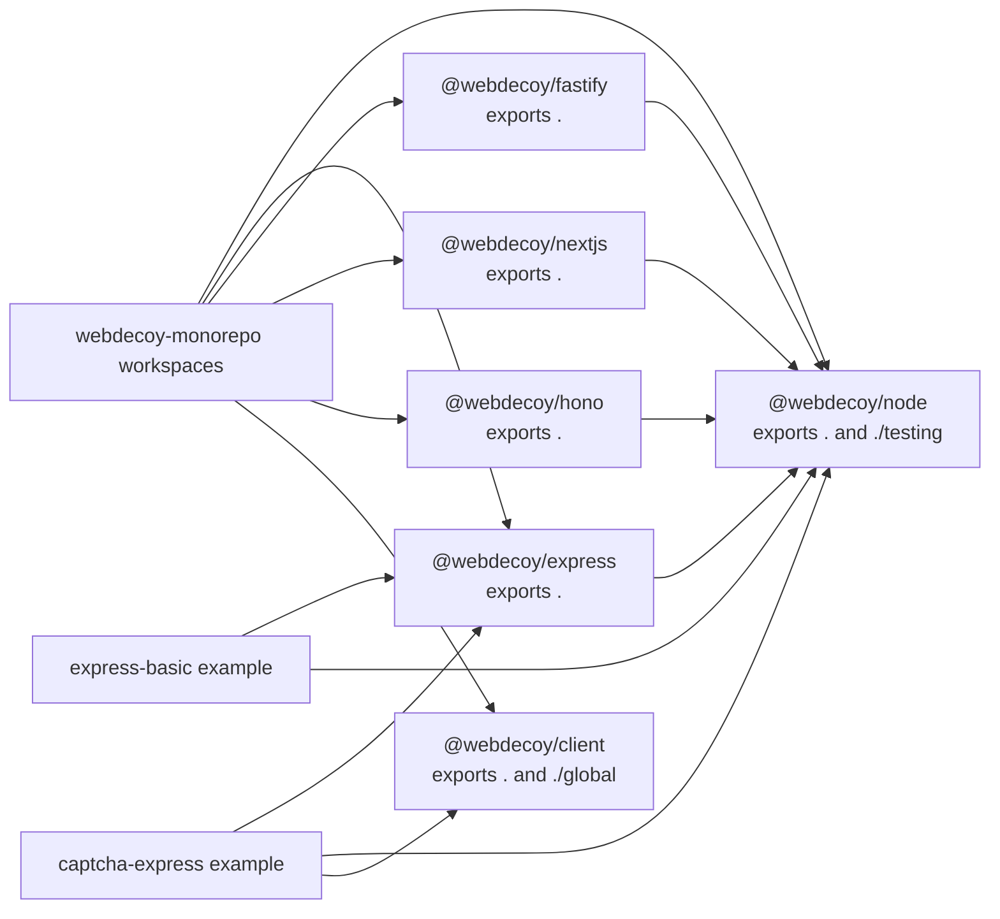

# Package Architecture, Public Surfaces, and Runtime Boundaries

WebDecoy is an npm-workspace monorepo, not one deployable application. Its product boundary is a group of packages: `@webdecoy/node` owns the protection engine and shared cross-framework policy, framework packages translate host requests and responses, and `@webdecoy/client` runs separately in a browser. The root package is private orchestration: it defines `packages/*` and `examples/*` workspaces and delegates build, lint, and test work to Turbo.

The important distinction for consumers and maintainers is **published package entry points versus source layout**. `src/` organizes implementation; an npm `exports` map and the `dist` allowlist determine what an installed consumer can import. A file that happens to be exported from a source barrel is a supported package-surface candidate only when it is reachable through the package's published entry point. Deep imports such as `@webdecoy/node/dist/...` and imports of TypeScript source are not a contract.



This diagram shows workspace membership, manifest dependencies, and published entry-point relationships; it does not mean that every public symbol in an adapter is implemented by the same core module.

## Package roles and supported import surfaces

| Package | Published subpaths | Responsibility and usual import | Host boundary |
|---|---|---|---|
| `@webdecoy/node` | `@webdecoy/node`, `@webdecoy/node/testing` | Core `WebDecoy`, decisions, local rules, client-IP resolution, fetch guard, captcha primitives/endpoints, bot and edge helpers. `testing` is deliberately separate for application test suites. | Designed around Web-standard APIs and tested in edge execution; some uses remain Node-oriented because the host adapter supplies sockets or Node response objects. |
| `@webdecoy/express` | `@webdecoy/express` | `webdecoy()` middleware and `webdecoyCaptcha()` Express middleware, plus types. | Node/Express request, socket, and `Response` lifecycle. Peer dependency supports Express 4 or 5. |
| `@webdecoy/fastify` | `@webdecoy/fastify` | Default Fastify plugin / `webdecoyPlugin` and `webdecoyCaptchaPlugin`, plus types. | Node/Fastify lifecycle; peer dependency supports Fastify 4 or 5. |
| `@webdecoy/nextjs` | `@webdecoy/nextjs` | `withWebDecoy()`, Pages wrapper `withBotProtection()`, edge verdict reader, Next honeytoken helper, and captcha route handlers. | Next middleware and App Router use Web APIs/edge-compatible graph; the Pages wrapper is explicitly Node-style. Peer dependency is Next `>=13`. |
| `@webdecoy/hono` | `@webdecoy/hono` | `webdecoy()` Hono middleware built over the core fetch guard. | Hono's portable `Request`/`Response` contract, for Workers, Bun, Deno, or Node. |
| `@webdecoy/client` | `@webdecoy/client`, `@webdecoy/client/global` | Browser captcha widget, signal collection, proof of work, and clearance behavior. The `global` subpath is the standalone script bundle. | Browser only; it does not depend on `@webdecoy/node`. It communicates with configured HTTP captcha/ingest endpoints. |
| `examples/*` | None | Private runnable integration examples, rather than libraries or stable installation APIs. | `express-basic` demonstrates server middleware; `captcha-express` joins Express endpoints to the browser bundle. |

All six packages ship only `dist`, and package manifests select ESM and CommonJS output (with declarations) for their library entry points. This is why consuming `src/index.ts` works in the repository but is not an installation pattern. `@webdecoy/client` additionally declares a browser global bundle; its build makes that entry an IIFE named `webdecoy.global.js` while its library entry is browser-targeted ESM/CJS.

### Core API: engine ownership, not framework ownership

The documented application-level core surface is imported from `@webdecoy/node`: construct `new WebDecoy(config)` for direct evaluation; create rules such as `tripwire()`, `rateLimit()`, `filter()`, `bots()`, or `webBotAuth()`; and examine the returned `Decision` / `ProtectResult`. The root entry also intentionally exposes reusable utilities such as `resolveClientIp()`, `readEdgeVerdict()`, `createFetchGuard()`, `clientSignals()`, captcha primitives, logging/tracing types, and bot-policy utilities. That permits a custom adapter or a non-framework fetch handler to use the same security decisions rather than copy them.

`WebDecoy.protect()` is the shared decision boundary. It builds a rule context, includes parsed edge and declared-bot information, runs local rules first, and returns a typed `Decision`. A denying or throttling rule is decided locally without a detection API call; with no API key, an otherwise allowed request remains a local allow. With a client configured, remote detection is used only when local analysis or TLS data warrants it, and remote deny/challenge results may be cached. Failure produces an `ERROR` decision that is allowed through: `allowed` remains true for `ERROR`, while `conclusion` lets callers distinguish a successful allow from fail-open operation.

The lower-level `adapter-core` functions are also re-exported by the root entry, specifically so a custom adapter can share skip-path matching, standard rule block descriptions, and site-honeytoken arming. They centralize policy, **not** framework I/O. Reading a request, writing a response, buffering or streaming HTML, and attaching framework-local state remain adapter responsibilities.

### Framework adapters: translate once, preserve one decision model

Each adapter constructs `RequestMetadata`, resolves an IP, calls its own `WebDecoy` instance's `protect()`, then either continues, records the result for downstream code, or writes a framework response. `mode` defaults to `'monitor'`: a denial is recorded but traffic continues. In `'enforce'`, a rule denial uses the shared response description—`403` for denial or `429` plus `Retry-After` for a throttle—while each framework performs the actual write. Custom `onBlocked` and `onError` hooks are the deliberate response/error extension points; protection errors otherwise fail open.

The adapters preserve an important common application contract: the full typed verdict is `webdecoyDecision`. Express and Fastify put it on the request, while Hono places it in its context under both `webdecoy` and `webdecoyDecision`. The older `webdecoy` request property is a narrower detection response in Node adapters and should not be mistaken for the full decision. Next middleware forwards decision/detection annotations as **request** headers to downstream application code rather than leaking them as response headers to the browser.

The shared `shouldSkipPath()` matcher accepts string prefixes or regular expressions. Thus `skipPaths` should be limited to routes intentionally exempt from all protection, such as health checks—not used as a generic route selector. A framework's route/matcher configuration controls where the adapter runs; `skipPaths` is the second, shared exemption check.

### Fetch is the portable adapter seam

`createFetchGuard()` is the portable implementation for a WHATWG `Request`/`Response` host. It owns a `WebDecoy` instance, translates request metadata (including URL path/query and resolved IP), and returns `{ decision, response? }`. In monitor mode `response` is absent even for a denial; in enforce mode it is the configured or standard block response. `decorate()` injects a site honeytoken only into eligible, unread HTML and returns the original response on a non-HTML body, consumed body, or rewrite error.

Hono is deliberately thin over that guard: it checks skips, calls `guard.check(c.req.raw)`, stashes the decision in context, optionally substitutes `onBlocked`, runs the rest of the chain, then decorates the completed response. Other fetch-native hosts can use `createFetchGuard()` directly rather than requiring another framework package.

Express and Fastify are not wrappers over the fetch guard because their response mechanics differ. Express intercepts `res.write`/`res.end` for eligible HTML; Fastify uses `onSend`; both avoid changing unsuitable bodies or breaking content length. Next cannot safely rewrite a streamed App Router/RSC response in middleware, so it exposes `honeytokenLink()` for an application layout to render and leaves arming the corresponding tripwire to application middleware. These are intentional lifecycle boundaries, not feature omissions.

## One shared security-policy core

`adapter-core.ts` exists because policy drift is security-sensitive. It has one implementation for skip matching, rule-denial response shape, and derive-and-arm behavior. In particular, a site honeytoken is derived asynchronously with WebCrypto from the API key, then its active path is armed with a tripwire before it can be advertised. Derivation from the same secret lets replicas independently produce the same path; a random per-process link could point to a trap armed only on a different replica.

The timing differs by host:

- `armSiteHoneytoken()` starts derivation without blocking startup and exposes a getter. Express and the fetch guard may serve a few early responses without a link while the HMAC settles.
- Fastify registration is already asynchronous, so it awaits `deriveAndArm()` before handling requests and has no equivalent early window.
- Next rendering uses the separately exported, per-secret-cached `honeytokenLink()` helper. The application must use the same API key and arm `bait.activePaths` in its middleware.

This also explains why manual HTML manipulation or hand-rolled block payloads are hazardous adapter changes. The cross-package invariant test scans shipped TypeScript sources to ensure forwarding headers are resolved only by the shared resolver, decisions are represented by `Decision`, rule response construction and skip matching stay in `adapter-core.ts`, and only the explicit Next render helper is allowed to derive a site honeytoken outside that core.

## Runtime boundaries: Node, edge, and browser

“Node” in `@webdecoy/node` describes the SDK's original server package and npm name, not a blanket Node-builtin requirement. Its request-path implementation uses Web-standard `fetch`, `Request`/`Response`, WebCrypto-oriented utilities, and timers so the core, Next middleware, and Hono graph can run in edge environments. A keyless core bundle is executed in an Edge Runtime VM in tests, including rate limiting/tripwire behavior, Web Bot Auth verification, and captcha token issue/verify/replay behavior.

The boundary is graph-wide, not a claim about one entry file. Root `check:edge` runs the core, Next, and Hono package checks. `scripts/check-edge.mjs` bundles each supplied source entry with esbuild for `platform: 'browser'` and ESM output while keeping framework hosts external. A reachable Node builtin consequently fails as it would in Vercel Edge Middleware. The invariant suite adds a source-level guard against `node:` imports anywhere in those three package source graphs. Run:

```bash
npm run check:edge
```

This does **not** make Express or Fastify edge packages: they depend on Node server framework contracts, including socket-derived client IP and framework-specific response APIs. It also does not make every Next export equally portable: `withWebDecoy()` is middleware-oriented, whereas `withBotProtection()` wraps a Pages API handler and reads `req.socket`. Choose the exported entry appropriate to the host runtime, rather than assuming the package name alone decides it.

Browser code is a separate graph. `@webdecoy/client` touches `window` and `document`, owns widget instances and browser collectors, and is built for `platform: 'browser'`; do not import it in server middleware. Its normal module surface exposes `WebDecoyCaptcha`, widget/invisible-session and collector primitives, proof-of-work, clearance functions, and public types. Its `./global` entry is for a direct `<script>`: it assigns `window.WebDecoyCaptcha`, auto-initializes `[data-webdecoy]` elements when the DOM is ready, and—when the script has `data-site-key`—starts clearance collection. The server side owns captcha verification and token lifecycle; the browser package never imports those server primitives.

## Captcha boundary and examples

The core's `createCaptchaEndpoints()` is the framework-neutral HTTP bridge. It maps normalized requests under `/__webdecoy` by default to challenge, verify, score, and token-verification operations. Express, Fastify, and Next captcha exports translate their native request/response types into this interface instead of separately implementing captcha policy. When a `signalStore` and browser `sessionId` are provided, `/score` persists the score/recommendation so later `clientSignals()` rule evaluation can use it; without that store the score is returned to the browser but is not joined to subsequent origin requests.

The `captcha-express` workspace demonstrates the intended package boundary: it mounts JSON parsing before `webdecoyCaptcha()`, serves the public global bundle through `require.resolve('@webdecoy/client/global')`, and protects a login flow with a captcha token. Its own comment notes a production concern: endpoint issue/verification and the protected check must share the same `Captcha` instance/store if single-use replay prevention is meant to span both. The `express-basic` workspace is a separate, private example of body parsing, skipped health checks, middleware registration, and reading Express detection data. Examples have `"*"` workspace dependencies for local development and must not be treated as versioned public APIs or copied without adapting operational settings.

## Testing-only and implementation-only boundaries

`@webdecoy/node/testing` is a real published subpath, but it is intentionally test-only. It supplies metadata builders (`request`, `get`, `post`, `botRequest`), a fresh offline/silent `createTestHarness()`, assertion helpers, and `protectMany()`. The harness removes an API key unless `allowNetwork: true`, preventing an ambient `WEBDECOY_API_KEY` from turning unit traffic into a live report; each harness creates its own rule state so rate-limit counters do not leak between tests. Keep it out of production bundles and import it by its explicit subpath.

Conversely, most files under `packages/*/src` are implementation modules, regardless of useful-looking names. Examples include `sdk.ts` orchestration internals, a framework's middleware/plugin implementation, client collectors, rule implementations, generated bot registry data, generated parity vectors, and tests. Consumers should use the documented root/subpath exports—not deep-import `adapter-core.ts`, `registry.generated.ts`, a collector, or a built artifact. `BOT_REGISTRY` is intentionally re-exported as a root value for inspection/classification, but `registry.generated.ts` is the generation artifact that supplies it and is not a direct editing or import extension point.

For maintainers, this leads to a safe change rule: add or alter an integration capability in the owning package's public barrel **and** export map/build entry only when it is meant to be supported. Otherwise keep it internal, test it through public behavior, and avoid teaching consumers a deep path that the `dist` layout or build format can invalidate.

## Build and operational checks

At the root, `npm run build`, `npm run lint`, and `npm test` invoke Turbo; its pipeline builds dependency workspaces before builds, lint, and tests, and treats `dist/**` as build output. Package builds produce their public distributions, while the root's `check:edge` has a narrower compatibility purpose and should be run after changing a dependency reachable from core, Hono, or Next.

Focused checks should follow the boundary being changed:

- Run the affected package's tests when changing a framework translation, then its package build so declarations and ESM/CJS entry points are exercised.
- Run `npm run check:edge` for reachable changes to `@webdecoy/node`, `@webdecoy/hono`, or `@webdecoy/nextjs`.
- Preserve the invariant suite when centralizing shared behavior; it is designed to detect duplicated answers that ordinary unit tests may not expose.
- Test consumer rules through `@webdecoy/node/testing`, where network use is opt-in, rather than importing internal rule-engine state.

For request semantics, enforcement rollout, captcha/browser signal flow, adapter configuration, and release commands, see [Captcha and browser signals](/openwiki/concepts/captcha-and-browser-signals.md), [Request decisions and enforcement](/openwiki/concepts/request-decisions-and-enforcement.md), [Framework adapters](/openwiki/integrations/framework-adapters.md), and [Build, test, and release](/openwiki/operations/build-test-and-release.md).
