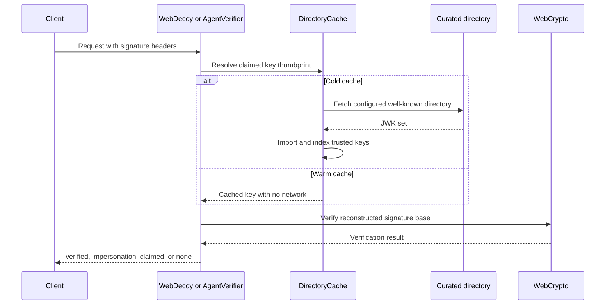
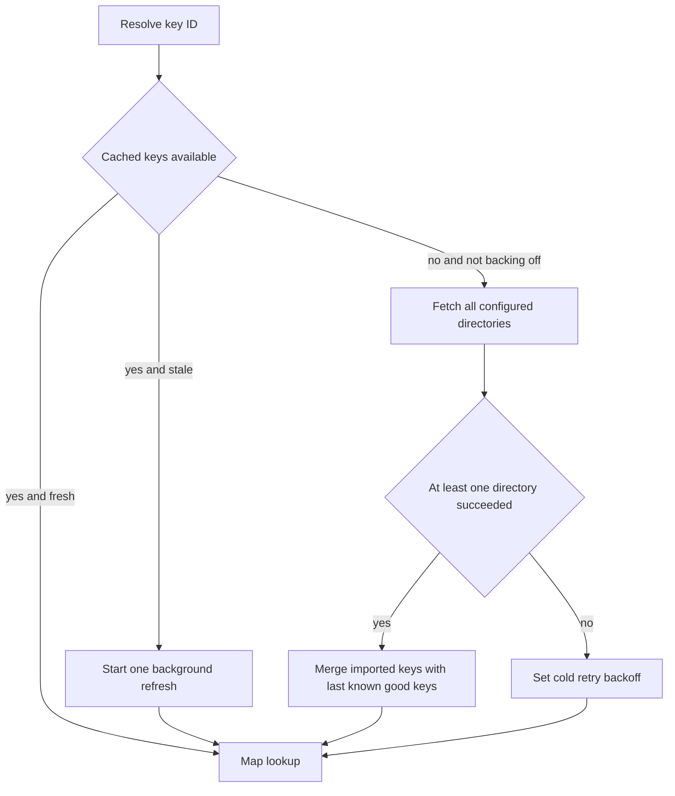

## Two different identity signals

WebDecoy intentionally keeps **declared bot classification** and **signed-agent verification** separate. They answer different questions and should lead to different application choices.

| Signal | Entry points | What it establishes | Appropriate use |
| --- | --- | --- | --- |
| User-Agent declaration | `matchUserAgent()`, `classifyUserAgent()`, `bots()`, `botPolicy()` | A client string matches a known registry pattern. It is not proof that the sender is that bot. | Publish and enforce a policy for cooperative crawlers, such as opting out of training crawlers while retaining search indexing. |
| `robots.txt` | `BotPolicy.robotsTxt()` | A published crawl preference, honored at the crawler operator's discretion. | Make the site policy visible to cooperative crawlers; do not rely on it as a security control. |
| Web Bot Auth | `WebDecoy.detectBot()`, `AgentVerifier`, `webBotAuth()` | A request signature was verified against a key from a curated trusted directory, or a known key was claimed but verification failed. | Identify a verified agent, deny a known-agent forgery, or impose explicit signed-agent/category requirements. |

A User-Agent can be changed by any caller. Consequently, an agent pretending to be a browser is not discoverable through UA matching, and a UA match must not be promoted to behavioral or cryptographic evidence. Conversely, Web Bot Auth is not a general bot detector: unsigned browser, crawler, and malicious traffic all may result in `none`; an unknown signed agent results in `claimed`, not automatic hostility. Use tripwires, rate limits, and other detection signals for adversarial behavior; see [Rules, Rate Limits, and Deception](/openwiki/concepts/rules-rate-limits-and-deception.md).

## Declared classification and one policy for publication and enforcement

`classifyUserAgent(userAgent)` performs a case-insensitive substring match against the generated `BOT_REGISTRY`. A known result includes the registry slug, display name, organization, category, registry score, declared `respectsRobots` property, and `isAI`; an unknown result is deliberately a fully formed verdict with `known: false`, `category: 'none'`, `score: 0`, and `isAI: false`. Classification is synchronous and local. It memoizes both matches and misses, but clears its bounded cache when it reaches 1,000 caller-controlled UA strings, preventing the optimization from becoming a memory-growth vector.

Registry order is match precedence: the first matching pattern wins. The generated table therefore must retain its source ordering rather than be sorted. This matters where a UA contains overlapping patterns and keeps the SDK aligned with the corresponding server-side registry.

### Apply a declared-crawler rule deliberately

`BotRule`—normally constructed through `bots()` or `BotPolicy.rule()`—only acts when `context.bot.known` is true. It can target categories, particular registry slugs or display names, or all four AI categories through `ai: true`. `allow` overrides every broad match, which protects explicitly permitted crawlers such as a search bot from a broad AI policy. A match defaults to `DENY`, can instead `THROTTLE`, and can be observed without enforcement with `dryRun`.

This is suitable when the policy itself is about the cooperative claimant: for example, “GPTBot says it is a training crawler, and this site does not grant training access.” It is not suitable for concluding that a client is malicious simply because it says `GPTBot`, or safe because it says `Mozilla`.

### Keep `robots.txt` and middleware policy in sync

`botPolicy()` resolves a single deny/allow selection from the same registry and exposes it in two forms:

- `policy.rule()` returns the enforcing `BotRule`.
- `policy.robotsTxt()` emits one `User-agent: <display name>` / `Disallow: /` group for each selected agent, plus by default a wildcard group that allows everything else.

Deny tokens may be categories, agent slugs, display names, or the `ai` shorthand. `robotsTxt()` also supports a sitemap, wildcard `Crawl-delay`, shared wildcard disallows, opting out of the permissive wildcard group, and removal of annotations.

`respectsRobots` records what an operator documents, not an observation of a particular request. `BotPolicy.unenforceable` lists selected agents whose registry record does **not** say they document honoring robots.txt; the default generated file annotates those lines as a voluntary request. The middleware rule is the part that enforces policy against traffic that self-identifies as one of those agents. A focused test asserts that the agents named in the generated file and the agents denied by `policy.rule()` are the same set, including allow-list exceptions.

```typescript
import { WebDecoy, botPolicy } from '@webdecoy/node';

const policy = botPolicy({
  deny: ['training_crawler'],
  allow: ['perplexitybot'],
});

// Serve policy.robotsTxt() at /robots.txt in the application.
const wd = new WebDecoy({ rules: [policy.rule()] });
```

## Verified identity with Web Bot Auth

Web Bot Auth verification implements the RFC 9421 HTTP Message Signature profile tagged `web-bot-auth`. It examines `Signature-Input` and `Signature`, selects tagged signature members, rebuilds their signature base from the inbound request, resolves the claimed `keyid` in cached trusted keys, and asks WebCrypto to verify it. The profile requires a signature to bind the host through `@authority` or `@target-uri`; a signature that does not do so cannot become verified.



*The local verification path uses only configured directories to turn a signature claim into a verdict.*

### Verdict taxonomy

The four statuses preserve an important security distinction.

| Status | Meaning | Safe default |
| --- | --- | --- |
| `verified` | A tagged signature validates using a resolvable key from a trusted directory. The verdict includes `agentName`, `category`, key ID, and algorithm. | Allow or attach the verified identity to application logic; optionally restrict categories. |
| `impersonation` | The request claimed a **known curated key**, but the signature was bad or the signature/key validity window failed. | Deny or throttle. This is evidence of an attempt to forge a known signed identity. |
| `claimed` | A signature exists but is malformed, unsupported, incomplete, not host-bound, or references an unknown key. | Continue to other signals by default. It proves neither a real agent nor a forgery. |
| `none` | No Web Bot Auth signature is present. | Treat as ordinary traffic and continue normal controls. |

When multiple tagged signatures are present, the core gives precedence to `verified`, then `impersonation`, then `claimed`, then `none`. A valid trusted signature therefore wins over weaker claims; a later unknown claim cannot downgrade an impersonation result. A half-present header pair and malformed syntax are `claimed`, not a fabricated forgery. Known-key failures include bad cryptography, expired/future signature timestamps, and published key validity bounds; the default clock tolerance is five minutes.

## Trust directories, cache lifecycle, and the SSRF boundary

A Web Bot Auth signature carries a claimed key identifier, but it does **not** control where WebDecoy fetches keys. `DirectoryCache` fetches only the `directories` configured in `AgentVerifierOptions`; it never treats an incoming `Signature-Agent` header as a URL. This curated allowlist is the SSRF boundary. Review every custom directory as a security trust decision, particularly if configuration can be altered by tenants or deployment-time inputs.

The default directory set contains OpenAI and OpenAI ChatGPT directories. A directory origin receives `/.well-known/http-message-signatures-directory` unless a path was explicitly supplied. Its JWK Set is imported into WebCrypto and indexed by the RFC 7638/8037 JWK thumbprint used as `keyid`, not by a mutable JWK `kid`. The implementation accepts profile-supported Ed25519/OKP and RSA keys and skips malformed or unsupported published keys.



*The cache blocks only an initial population attempt; established keys serve verification while refresh proceeds.*

The default TTL is six hours and each directory fetch defaults to a five-second timeout. A cold cache blocks once to obtain keys; if all directories fail while no keys exist, it backs off for 30 seconds instead of retrying every request. Once any keys are present, expired data uses stale-while-revalidate: callers keep using cached keys while one de-duplicated refresh runs. Refresh begins from last-known-good keys, so a transient failure of one directory does not delete live keys. `warmup()` starts this fetch without blocking and is automatically invoked when a `WebDecoy` instance is configured with `webBotAuth()`.

The result is intentionally no-network on the warm verification path: header parsing, a map lookup, and one WebCrypto verification. This behavior is tested by counting the injected `fetchImpl` across repeated verifies after a cold population, rather than depending on an unstable wall-clock assertion.

Configure additional trusted agents only when their directory is expected and controlled:

```typescript
const wd = new WebDecoy({
  webBotAuth: {
    directories: [
      { name: 'OpenAI', category: 'ai_crawlers', directory: 'https://operator.openai.com' },
      { name: 'Acme Crawler', category: 'monitoring', directory: 'https://crawler.acme.example' },
    ],
    cacheTtlMs: 6 * 60 * 60 * 1000,
  },
});
```

`fetchTimeoutMs`, `toleranceSec`, `debug`, and `fetchImpl` are also configurable. The injectable fetch implementation is chiefly a test seam; do not implement it by resolving request-controlled destinations.

## Choose an integration surface

### Handle the verdict yourself

`WebDecoy.detectBot(request)` delegates to the instance's shared verifier. `createAgentVerifier()` / `AgentVerifier.verify()` are the lower-level alternative. Both accept either a WHATWG `Request`—natural for middleware and edge runtimes—or `{ method, url, headers }` with an absolute URL for Node HTTP integrations.

```typescript
const verdict = await wd.detectBot(request);

if (verdict.status === 'impersonation') {
  return new Response('Forbidden', { status: 403 });
}
if (verdict.status === 'verified') {
  // Use verdict.agentName and verdict.category as signed identity attributes.
}
// claimed and none proceed to the application's ordinary controls.
```

This is the right surface when application code needs to tag a request, select a route-specific experience, or make a decision that cannot be represented by a rule. It is also the clearest way to make the conservative default for `claimed` explicit.

### Use `webBotAuth()` in the rules engine

`webBotAuth()` keeps signature processing asynchronous but rule evaluation synchronous: `WebDecoy.protect()` and `evaluateRulesAsync()` compute `context.agent` before evaluating rules. The rule defaults to `onImpersonation: 'DENY'` and `onClaimed: 'ALLOW'`; `none` and an allowed verified verdict pass. A missing host is different from `none`: metadata-based verification cannot construct the host-bound signature base, so the rule reports `NOT_RUN` and allows rather than guessing.

```typescript
import { WebDecoy, webBotAuth } from '@webdecoy/node';

const wd = new WebDecoy({
  rules: [
    webBotAuth({
      onImpersonation: 'DENY',
      onClaimed: 'ALLOW',
      allowCategories: ['ai_crawlers'],
      dryRun: false,
    }),
  ],
});
```

`allowCategories` does not make a disallowed verified agent cryptographically invalid. It applies product policy after verification: a verified category outside the set is handled using `onClaimed`. Set `onClaimed: 'DENY'` only when the application truly requires every signed request to come from its curated trust set; it will also reject unknown future signers and malformed signature claims. `dryRun` preserves verdict metadata while returning `ALLOW`, which supports a staged rollout.

Rules run in configured order and the engine's first non-dry-run `DENY` or `THROTTLE` decides the local result. The agent verdict is retained on the resulting `Decision`, including locally allowed and locally denied flows. See [Request Decisions and Enforcement](/openwiki/concepts/request-decisions-and-enforcement.md) for how adapters consume that decision.

## Metadata and runtime considerations

For direct `Request` inputs, the verifier gets the actual absolute request URL. For `protect()` metadata, WebDecoy reconstructs the verification input from `Host`, `:authority`, or `X-Forwarded-Host`, uses the first `X-Forwarded-Proto` value (otherwise `https`), and combines it with the request path. If no host is available, verification is skipped rather than inventing an authority. Ensure framework adapters preserve the externally visible host and scheme correctly; proxy-header trust remains an integration concern described in [Framework Adapters](/openwiki/integrations/framework-adapters.md).

The verification implementation uses Web Platform APIs—`crypto.subtle`, `fetch`, `Request`, `Headers`, `URL`, and `atob`—rather than Node built-ins. An Edge Runtime VM test bundles the SDK for the browser platform and verifies a real Ed25519-signed request inside the VM. This makes the local verifier suitable for Node and WinterCG-style edge middleware, subject to the runtime's WebCrypto support and normal cold-start cache behavior.

## Operational rollout and test focus

1. Start UA-based crawler policy in `dryRun` if blocking could affect discovery. Review category and allow-list choices, especially explicit search-engine exemptions.
2. Publish `policy.robotsTxt()` from the same `BotPolicy` that supplies middleware enforcement so the visible and enforced policies cannot drift.
3. Add `webBotAuth({ dryRun: true })`, observe `impersonation`, `claimed`, and category outcomes, then enable the default impersonation denial. Do not turn unknown signed traffic into a hostile verdict without a business requirement.
4. Prime the verifier during startup or let the SDK prime it when the rule is present. Monitor directory reachability, cache refresh diagnostics when `debug` is enabled, and the one-time cold-path impact rather than expecting network access on every request.
5. Treat directory configuration and proxy host/scheme reconstruction as security-sensitive deployment configuration. Use a short, curated directory list and test signature verification behind the actual proxy chain.

The most valuable tests here are not just happy-path checks: independent signature construction pins the exact RFC 9421 byte contract; tests distinguish bad known-key signatures (`impersonation`) from unknown keys (`claimed`), reject signatures lacking host binding, test expiration, exercise plain Node-shaped requests, and establish the no-network warm-path invariant. Separate tests cover classifier case-insensitivity, safe unknown verdicts, bounded caching, first-match registry precedence, `allow` override behavior, generated `robots.txt` parity with enforcement, and Web Bot Auth rule defaults/category restrictions/dry-run behavior.

For staged enforcement, response handling, and production fail-open considerations, see [Production Rollout and Safety](/openwiki/operations/production-rollout-and-safety.md).
