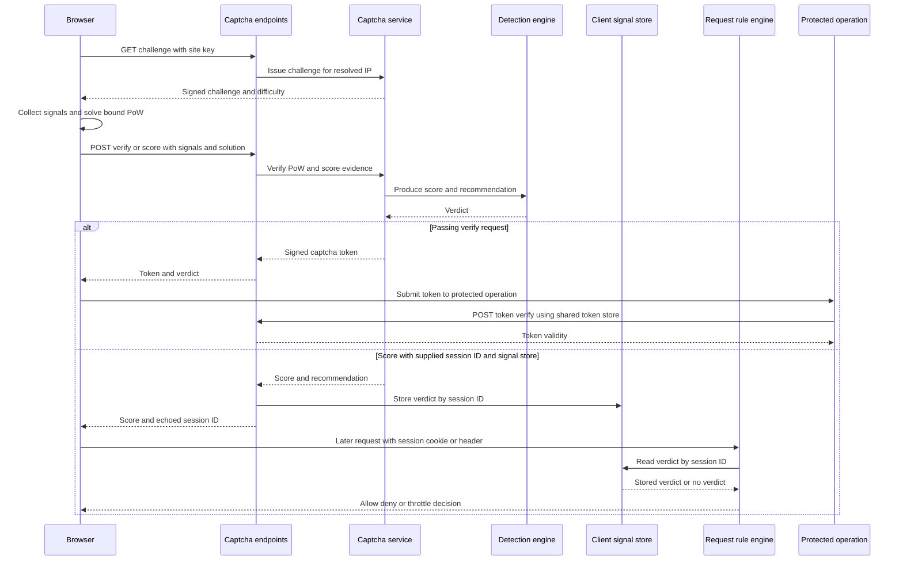

## Scope and trust model

WebDecoy has two related but distinct browser-facing capabilities:

1. **Self-hosted captcha** verifies one interaction. `@webdecoy/client` collects browser evidence, solves a server-issued SHA-256 proof of work (PoW), and submits it to a `Captcha` service. A passing server verdict can mint a short-lived signed token for a sensitive operation such as login.
2. **Client-signal enforcement** carries an invisible-mode score forward to the application's ordinary request rules. `clientSignals()` looks up the server-recorded verdict for the browser session and can deny or throttle a later request.

Neither mechanism turns browser-provided data into proof of humanity. Signals are claims made by JavaScript running under the visitor's control; sophisticated automation can spoof them. Their value is probabilistic evidence, especially against automation running a genuine browser and avoiding deterministic traps. Keep them alongside deterministic controls such as tripwires, rate limits, and attack signatures; see [Rules, Rate Limits, and Deception](/openwiki/concepts/rules-rate-limits-and-deception.md).

A particularly important availability boundary is deliberate: a request without a browser session, or with a session for which no verdict exists, is `NOT_RUN` and allowed by this rule—not denied. This protects non-JavaScript clients, command-line clients, and legitimate crawlers from being treated as suspicious merely because they did not run the widget.

## Components and responsibilities

| Component | Responsibility | State it owns or consumes |
| --- | --- | --- |
| `WebDecoyCaptcha` / `CaptchaWidget` | Renders an accessible checkbox, collects evidence until interaction, obtains a challenge, solves PoW, and calls `/verify`. | A widget-local token and client-side collector state. |
| `InvisibleSession` | Collects passive signals, can intercept a form submission, submit to `/score`, inject `webdecoy_token`, and retry the form. | A generated session ID, a cached score for 60 seconds, listeners, and a PoW manager. |
| Client `PoWManager` | Fetches a challenge and uses inline Web Workers across nonce strides to find a hash with the required leading zeroes. | Current challenge and solution. |
| `Captcha` | Composes challenge verification, `DetectionEngine` scoring, and token issuance. | Detection stores, challenge store, token store, and signing secret. |
| `createCaptchaEndpoints()` | Normalizes the four HTTP routes so adapters only translate framework request/response objects. Optionally writes invisible-score verdicts to `ClientSignalStore`. | One `Captcha` instance per endpoint factory and optional signal store. |
| `ClientSignalRule` / `clientSignals()` | Reads `wd_cs` first, then `x-wd-session`, retrieves the matching verdict, and translates it into an ordinary rule result. | `ClientSignalStore` plus any async prefetch result in rule context. |

`@webdecoy/express`, `@webdecoy/fastify`, and `@webdecoy/nextjs` all wrap the normalized endpoint factory rather than reimplementing captcha semantics. Express requires `express.json()` before its captcha middleware. The adapters also resolve the client IP before calling the service; configure trusted proxy handling correctly because PoW scaling, rate detection, and optional token IP binding all depend on that identity. See [Framework Adapters](/openwiki/integrations/framework-adapters.md).

## Browser-to-decision sequence



*The score-to-rule branch is conditional on an integration supplying the same session ID to `/score`, persisting its verdict, and sending that ID on the later request.*

### What the browser collects

Both widget modes assemble behavioral, environmental, temporal, form-analysis, and metadata records. Examples include pointer trajectory and variance, clicks, scrolling and key events; `navigator.webdriver`, plugin and automation indicators, rendering and sensor evidence; time to first interaction and session duration; and form dwell, paste-versus-key, and submit timing aggregates. The published client-signals documentation states that this contract excludes page content and form values.

The checkbox starts collection and requests a challenge when constructed; it collects and submits on click. `InvisibleSession` begins passive collection immediately, records the first interaction once, fetches a challenge asynchronously, and waits for `minCollectionTime` before executing. Its default is 2 seconds; the one-shot `WebDecoyCaptcha.execute()` helper uses 1 second and destroys its temporary session afterward. With `autoScore` enabled, the invisible session synchronously cancels a form submission when its cached result is older than 60 seconds, scores it, inserts or updates a hidden `webdecoy_token` field, then resubmits only on a successful result. On a client error it deliberately submits the form anyway (fail open).

The browser serializes the complete signal object and hashes it. That hash is incorporated into the PoW input as well as sent alongside the raw JSON. Consequently, the service can detect a raw-signal/hash mismatch before it scores the payload, and a valid PoW solution is bound to the submitted evidence rather than being freely transferable to an altered payload.

### Server challenge, verification, and scoring

`GET {basePath}/challenge?siteKey=` issues an HMAC-signed challenge with a random ID and challenge nonce, a five-minute expiry, and a leading-zero difficulty. The default difficulty starts at 4, increases for known datacenter IPs and higher challenge-request rates, and is capped at 6. The service checks that the submitted challenge exists, is unexpired, has the same site key, hashes to the expected value, meets difficulty, and has not already consumed its solution. It deletes a successfully solved challenge, so a second use fails.

`Captcha.verify()` then passes the PoW outcome, request IP, user agent, headers, optional TLS fingerprint data, and signals into `DetectionEngine`. The engine combines PoW observations—such as absent/invalid work, challenge-nonce mismatch, and server-measured suspiciously fast completion—with headless, automation, CDP, behavioral, fingerprint-correlation, rate, datacenter, header, browser-consistency, form, and advanced-signal detectors. It produces a score from 0 to 1, where higher is more bot-like, plus `allow`, `challenge`, or `block`; the default recommendation bands are below 0.3, 0.3 through below 0.6, and 0.6 or greater respectively. `weights` can override the detection category weights.

Do not treat client-reported timing, client-provided `x-ja3-hash`, or any browser signal as authoritative. The service's elapsed time between issue and verification is server-measured; `trustedJA4Headers` is specifically for headers inserted by a trusted reverse proxy. More generally, browser evidence should initially be observed with `dryRun: true` before it contributes to a production block decision.

## HTTP contract and framework entry points

`createCaptchaEndpoints({ basePath, secret, ...stores })` defaults to `/__webdecoy` and returns `{ captcha, basePath, handle }`. Its normalized handler falls through with `null` for unrelated paths and otherwise exposes:

| Method and route | Role |
| --- | --- |
| `GET /__webdecoy/challenge?siteKey=` | Issue the signed PoW challenge. |
| `POST /__webdecoy/verify` | Verify checkbox-style signals and work; return the full verdict and token when successful. |
| `POST /__webdecoy/score` | Run invisible-mode verification and return compact score, recommendation, action, and token fields. |
| `POST /__webdecoy/token/verify` | Verify a token, returning `400` with `missing_token` when absent. |

Set the browser endpoint origin and mount path together with the server configuration:

```typescript
import { WebDecoyCaptcha } from '@webdecoy/client';

WebDecoyCaptcha.configure({
  serverUrl: window.location.origin,
  basePath: '/__webdecoy',
});
```

`configure()` sets an origin only when `serverUrl` is truthy, so even for a same-origin installation the current client needs a nonempty origin such as `window.location.origin` to take the server-backed path. If no server URL is configured or a fetch fails, the browser code falls back to a local challenge and lightweight client-side score. That fallback can inform UI behavior, but it is **not** a server-verifiable authorization result. A sensitive server route must verify the token through `Captcha.verifyToken()` or `/token/verify`, using production signing and persistence configuration.

For Express, mount JSON parsing and captcha endpoints before protected routes:

```typescript
import express from 'express';
import { webdecoyCaptcha } from '@webdecoy/express';

const app = express();
app.use(express.json());
app.use(webdecoyCaptcha({ secret: process.env.WEBDECOY_SECRET }));
```

Use `webdecoyCaptchaPlugin` for Fastify or `createCaptchaHandler()` in the Next.js App Router catch-all route. The latter belongs at `app/__webdecoy/[...webdecoy]/route.ts`. Do not put a real secret in client code, source control, or a wiki example. Production rejects a missing secret and rejects the built-in development default; provision a strong deployment secret through the platform's secret mechanism.

## Token lifecycle and replay boundary

A passing server verification creates a base64url JSON token signed with HMAC. Its payload contains the site key, issuance timestamp, rounded score, and a truncated hash of the issuing IP. A token expires after five minutes. Verification checks decoding, expiry, signature in constant time, whether its signature has already been consumed, and—when an IP is supplied—whether the IP hash matches. A successful verification consumes the token, making it single-use.

This lifecycle means a token verifier needs the same signing secret for cryptographic validity and a shared `TokenStore` for replay protection across every verifier. The captcha example intentionally calls out this issue: a separately constructed `Captcha` instance can verify a signature made with the same secret, but its default in-memory replay set is independent. In production, share the service/store boundary used by issuance and consumption, rather than relying on two per-process defaults.

## Making invisible scores affect subsequent rules

The server-side connection is explicit. Give the endpoint factory a `signalStore`, then give the exact same store to the normal request middleware:

```typescript
import { webdecoyCaptcha, webdecoy } from '@webdecoy/express';
import { MemoryClientSignalStore, clientSignals } from '@webdecoy/node';

const signalStore = new MemoryClientSignalStore();

app.use(express.json());
app.use(webdecoyCaptcha({
  secret: process.env.WEBDECOY_SECRET,
  signalStore,
}));
app.use(webdecoy({
  rules: [clientSignals({ store: signalStore, dryRun: true })],
}));
```

On `POST /score`, the endpoint records `{ sessionId, score, recommendation, at }` only when both `signalStore` and a **top-level** request-body `sessionId` are supplied. It echoes that ID in the response. On a later request, `ClientSignalRule` reads `wd_cs` from `Cookie` first and falls back to `x-wd-session`; it uses the stored recommendation by default, or treats `minScore` as an explicit override. A matching bad verdict becomes `DENY` by default, can be changed to `THROTTLE`, and becomes an allowed but annotated result when `dryRun` is set.

### Current client handoff limitation

The persistence configuration above is necessary but is not sufficient with the currently inspected browser implementation. `InvisibleSession` puts its generated ID in `signals.meta.sessionId`, while its `/score` request body does not send the top-level `sessionId` that `createCaptchaEndpoints()` reads. The client source also does not set the `wd_cs` cookie, and the endpoint only echoes the ID rather than emitting `Set-Cookie`.

Therefore, stock `InvisibleSession` does **not** currently complete the documented score-to-subsequent-request handoff by itself. Until the client and endpoint contracts are aligned, an integration must provide a compatible handoff—submit the same ID at the endpoint's expected top-level field, persist through the configured store, and send it as `wd_cs` or `X-WD-Session` on later requests—or treat the score as response-local. Do not assume a score returned to the browser is automatically known to origin middleware.

This distinction also explains the rule's safe behavior:

- no cookie/header → `ALLOW` with state `NOT_RUN`;
- a supplied session ID without a current store verdict → `ALLOW` with state `NOT_RUN`;
- a nonblocking stored verdict → `ALLOW` with score/recommendation metadata;
- a blocking verdict → configured `DENY` or `THROTTLE`, unless `dryRun` keeps it allowed.

`ClientSignalStore` permits synchronous or asynchronous implementations. For an async store, `ClientSignalRule.prepare()` fetches the verdict before synchronous evaluation and saves it in request context. The in-memory store is synchronous, has a 15-minute default TTL, limits itself to 10,000 sessions, expires entries on read, and evicts the oldest entry when full.

## Persistence and multi-instance operation

All supplied defaults are process-local. They are suitable for development, a single long-lived process, and focused tests—not a reliable multi-replica design:

| State | Default | What breaks across instances | Production requirement |
| --- | --- | --- | --- |
| Pending PoW challenges and consumed solutions | `InMemoryChallengeStore` | Challenge issue and submission may hit different processes; replay prevention is not global. | Implement `ChallengeStore` using shared atomic persistence. |
| Consumed captcha-token signatures | `InMemoryTokenStore` | A replay can be accepted by an instance that has not recorded the first use. | Implement one shared `TokenStore` with atomic consume semantics. |
| Detection fingerprint correlation and PoW rate scaling | `InMemoryFingerprintStore` and `InMemoryRateLimiter` | Correlation and rate pressure become per-instance, weakening detection and inconsistent difficulty. | Supply shared `FingerprintStore` and `RateLimiter`. |
| Browser score verdicts | `MemoryClientSignalStore` | `/score` and the following request can land on different replicas, yielding `NOT_RUN`. | Implement a shared `ClientSignalStore` and use the same instance/configuration in endpoint and rule construction. |

The interfaces are intentional extension points. They do not by themselves make a backing store safe: challenge and token replay operations must be atomic, expiry must be enforced, and all replicas must use the same signing secret. Retain the privacy boundary as well: store only the verdict needed for rule evaluation where possible, set a TTL appropriate to the flow, and assess the browser signal payload before adding durable logging.

## Operational rollout and tests

1. Start captcha and client-signal enforcement in observation mode. For `clientSignals()`, use `dryRun: true`, inspect score distribution and false-positive risk, then choose either the engine's `block` recommendation or a measured `minScore` threshold.
2. Configure the actual proxy trust boundary for the selected adapter. A forged forwarding header can undermine IP-based difficulty, rate controls, and optional token IP binding.
3. Replace every in-process state holder before adding replicas, serverless concurrency, or separate token-verification services. Test cross-instance issue/solve, score/request, and single-use token replay explicitly.
4. Keep the server endpoint available on the configured origin/path and require server verification for sensitive actions. Client fallback is fail-open behavior, not a security control.

The focused repository tests provide useful regression anchors:

- `packages/webdecoy/src/captcha/captcha.test.ts` covers production-secret rejection, challenge generation and replay/expiry failures, signal-hash binding, token signature/expiry/IP/single-use checks, human and bot end-to-end outcomes, and invisible action echoing.
- `packages/webdecoy/src/captcha/http.test.ts` exercises the normalized route surface, unrelated-path fallthrough, default and custom base paths, and challenge-to-token verification through the handler.
- `packages/webdecoy/src/client-signals.test.ts` proves cookie/header extraction, TTL and capacity behavior, `NOT_RUN`, threshold and dry-run semantics, async prefetch, and conditional `/score` store persistence followed by rule enforcement.

Run the repository suite with:

```bash
npm test
```

For broader deployment safety and monitor-to-enforce practice, see [Production Rollout and Safety](/openwiki/operations/production-rollout-and-safety.md); for application-level harness patterns, see [Application and Repository Tests](/openwiki/testing/application-and-repository-tests.md).
