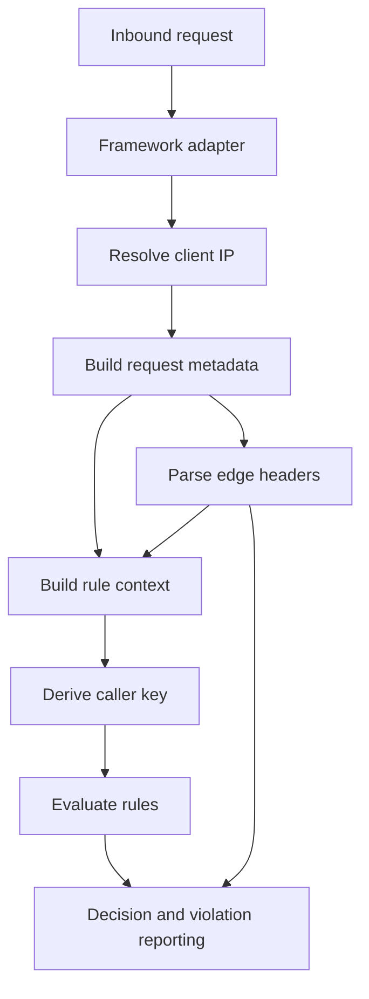
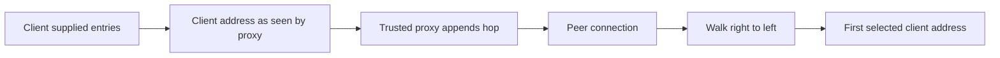

## Identity is an input to every decision

WebDecoy distinguishes two related questions:

1. **What address sent this request?** Adapters resolve `RequestMetadata.ip` before they call `WebDecoy.protect()`.
2. **What counts as the same caller?** The SDK builds `RuleContext.key` from `characteristics`, which keyed rules and the decision cache can use.

They are not interchangeable. An IP address is a network attribution input, useful for unauthenticated traffic and IP enrichment, but it is not a durable user or tenant identity. An API key, JWT subject, or tenant identifier may be the right subject for an authenticated API. Conversely, replacing the caller key does not make a spoofed address safe for IP reputation, detection reports, or rules that explicitly use `context.ip`.

The resolved IP enters the rule context, violation reports, IP enrichment, local analysis, and the remote detection request. The characteristic key is then derived from that completed context. A `RateLimitRule` uses its own `keyBy` when provided; otherwise it uses that SDK-wide key. Thus proxy configuration can change both enforcement behavior and the IP reported for a violation, while characteristics can deliberately change the buckets used by keyed controls.



*The adapter supplies the address, while the SDK derives a reusable caller key and edge context before rules and reporting consume them.*

## Resolve addresses from the controlled end of the chain

`resolveClientIp({ headers, peer, trustProxy })` centralizes forwarding-header interpretation for adapters and custom integrations. It accepts Node-style header bags and WHATWG `Headers`, normalizes valid IPv4 and IPv6 values, removes common address decoration such as ports, brackets, and IPv6 zone IDs, and collapses IPv4-mapped IPv6 to IPv4. Invalid addresses are not turned into plausible keys.

The key security rule is that forwarding chains are evaluated from the **right**, beginning with hops controlled by the deployment—not from the client-controlled left side of `X-Forwarded-For`. The observed order is `[..., X-Forwarded-For, peer]`: each proxy appends the address from which it received the connection, so the rightmost entries are the closest infrastructure hops. For a declared depth of one, the last `X-Forwarded-For` address is selected; for two, it is the second from the right. Prefixing arbitrary addresses to the left cannot move that answer.



*Trust starts at the peer and controlled proxy hops on the right; values farther left become usable only after the declared topology has been traversed.*

### `trustProxy` modes and fail-safe behavior

| Setting | Resolver behavior | Deployment requirement |
| --- | --- | --- |
| `false` or `0` (default for the resolver) | Ignore forwarding headers and use the normalized peer address. | Correct for a directly exposed process; conservatively attributes proxied traffic to the proxy rather than accepting a forged header. |
| Positive integer | Treat it as the number of trusted proxies between client and process and select the corresponding entry from the right of `X-Forwarded-For`. | Keep it equal to the actual, fixed number of intermediary hops. |
| `'cloudflare'` | Use `CF-Connecting-IP`, falling back to the peer if missing or invalid. | The origin must be reachable only through Cloudflare; otherwise any direct caller can send this header. |
| CIDR/address array | Add the peer to the chain, walk right to left through addresses belonging to the supplied ranges, and choose the first non-member. | Use for variable-depth infrastructure and keep the ranges restricted to proxies the operator controls. |

When a configured source is absent, malformed, or inconsistent with the declared topology, the resolver favors the real peer rather than scanning farther left for a plausible client address. A numeric depth that is negative, fractional, or deeper than the received chain falls back in the same conservative direction. A malformed entry also stops a CIDR walk because nothing to its left can be established as infrastructure-authored evidence.

Only after proxy trust has been explicitly enabled does the resolver consider the single-address fallbacks `X-Real-IP` and the last `X-Vercel-Forwarded-For` value. A valid `X-Forwarded-For` chain has precedence over both. With `trustProxy: false`, all of these headers are ignored because they are no less forgeable than `X-Forwarded-For`.

### Framework defaults are intentionally not uniform

The source of a trustworthy peer differs by runtime, so the adapter defaults differ as well:

| Integration surface | When `trustProxy` is omitted | Important consequence |
| --- | --- | --- |
| Express `webdecoy()` | Defers to `req.ip`, so Express's own `app.set('trust proxy', ...)` controls the result; without it Express uses the socket address. | Configure proxy trust once in Express, or set WebDecoy's `trustProxy` to override it only for WebDecoy. |
| Fastify `webdecoyPlugin` | Defers to `request.ip`, which follows Fastify's server `trustProxy` setting and otherwise the socket address. | Like Express, a correctly configured framework need not be configured twice. |
| Next.js Edge `withWebDecoy()` | Defaults to one trusted hop because edge middleware has no portable socket peer. | `1` fits Vercel or a single proxy; set `2` for a CDN before the platform, or use `'cloudflare'` only with a locked-down origin. |
| `createFetchGuard()` and Hono | Defaults to one trusted hop for the same fetch-runtime limitation. Hono delegates to the fetch guard. | Supply the actual topology; behind Cloudflare, `'cloudflare'` is stronger than counting when origin isolation holds. |
| Next.js Pages `withBotProtection()` | Runs on Node and defaults to no trusted forwarding header unless configured. | This is distinct from Next Edge middleware; it can use the socket peer, so do not assume the Edge default applies. |

An explicit `getIP` always overrides `trustProxy`, framework defaults, and resolver behavior. This is an extension point for a platform-specific authenticated connection attribute, but it transfers responsibility for validation, normalization, and stable semantics to the application. Do not return a request-controlled forwarding header from `getIP` without implementing an equivalent trust boundary.

```typescript
app.use(webdecoy({
  trustProxy: 1,
  rules: [rateLimit({ max: 100, window: 60 })],
}));
```

Use a hop count only when all routes to the application have the same depth. Prefer precise CIDRs when traffic can reach the origin through different controlled proxy paths; a count can accidentally trust an attacker-supplied entry on a shorter path.

### What incorrect proxy trust breaks

**Under-trusting** is generally an availability and observability problem: all visitors behind a reverse proxy can appear as that proxy. A per-IP rate limit then becomes a shared site-wide bucket, IP enrichment describes the proxy rather than the visitor, and reports lose the useful caller address.

**Over-trusting** is a security problem. If an attacker can influence a trusted position or a direct origin connection, they can select the address used by IP-keyed rate limits, IP-based filter expressions, local analysis, and reporting. Historically, choosing the leftmost `X-Forwarded-For` entry let a caller use a different forged address on every request, creating fresh rate-limit buckets and contaminating reported violations. The focused Express integration test demonstrates both the regression and the protection: forged leftmost values do not bypass a limit by default, while a declared hop separates genuine clients and ignores chain padding.

Treat proxy topology as security configuration. Test the deployed path—not just local development—using direct-origin attempts, expected CDN/platform combinations, IPv6 where applicable, malformed chains, and several clients behind the same proxy. Roll out controls in monitoring or rule `dryRun` mode first when a bad identity mapping could block legitimate traffic. See [Production Rollout and Safety](/openwiki/operations/production-rollout-and-safety.md).

## Make the caller key match the control being applied

`WebDecoyConfig.characteristics` defaults to `['ip']`. Each characteristic may be one of the built-in fields `ip`, `path`, `method`, or `userAgent`, or a function receiving the full `RuleContext`. Resolved parts are joined with `|` in their specified order. This makes it possible to scope a budget by endpoint as well as caller, or to use an authenticated tenant/API-key identity shared across a NAT.

```typescript
const wd = new WebDecoy({
  characteristics: [(ctx) => ctx.headers['x-api-key']],
  rules: [rateLimit({ max: 100, window: 60, action: 'THROTTLE' })],
});
```

A custom characteristic can read normalized context fields and can return `undefined`. If **any** requested component is absent—or if a custom function throws—the entire derived key falls back to `context.ip`. It does not create an empty-part key. That fallback avoids silently grouping every unauthenticated request into one shared bucket, which could turn a per-tenant policy into an anonymous-traffic outage. An empty `characteristics` array also returns the IP.

A rule-specific `rateLimit({ keyBy })` has higher precedence than `characteristics`. Use it when one rate limit intentionally needs a different subject from the rest of the SDK. In particular, changing SDK characteristics does not change a rule that explicitly chooses `context.ip`; document that choice alongside the policy.

The same caller key also indexes the bounded decision cache for remote `DENY` and `CHALLENGE` verdicts. Local rule outcomes and `ALLOW` decisions are intentionally not cached: a rate limiter must observe every request and a cached allow would postpone reassessment of a caller that begins misbehaving. This makes identity-key design relevant to both rate-limit fairness and how broadly a remote negative decision is reused. See [Rules, Rate Limits, and Deception](/openwiki/concepts/rules-rate-limits-and-deception.md) and [Request Decisions and Enforcement](/openwiki/concepts/request-decisions-and-enforcement.md).

## Edge verdicts are advisory context with a network trust boundary

The Cloudflare clearance worker may annotate forwarded requests with `x-wd-clearance` and, when it classifies the client, `x-wd-class`. `readEdgeVerdict()` turns those headers into an `EdgeVerdict`, and `WebDecoy.protect()` parses and attaches the same value to every resulting `Decision`. The SDK also places it in the rule context, allowing filter expressions such as `edge.present and edge.class == "crawler"` or `edge.script`.

| Field or predicate | Meaning |
| --- | --- |
| `present` | At least one usable edge annotation was found. `false` means **no information**, not human, browser, safe, or passed. |
| `clearance` | A nonempty clearance label such as `valid` or `missing`. It deliberately remains free-form so new worker labels survive SDK version skew. |
| `class` | One of `verified`, `crawler`, `script`, or `browser`; unknown class values are discarded rather than offered to application branches. |
| `isVerified`, `isCrawler`, `isScript`, `isBrowser` | Convenience predicates for an accepted class. |
| `isUnattestedNonBrowser` | True only for `script` or `crawler`, deliberately excluding the attested `verified` class. |

`verified` represents an identity attested by something other than the client, such as a Cloudflare verified-bot signal. `crawler` is self-declared and unproven. `script` represents signals such as an HTTP client library, missing user agent, or a browser user agent without expected hints. `browser` only means no current signal distinguished it as non-browser; it is not proof of a human.

The headers are **not authentication by themselves**. They become trustworthy only when the application can establish that every request reaching its origin passed through the validator, which strips inbound copies before writing its own annotations. Before branching on edge context for access, pricing, or a reduced experience, restrict origin ingress to the edge/proxy network and ensure no alternate hostname, direct origin IP, internal route, or bypass path can reach the application with caller-supplied headers. Without that isolation, a direct client can claim any `x-wd-*` value; without a header, it can evade a branch that incorrectly treats absence as a pass.

### Read the verdict at the appropriate boundary

- Core integrations can call `readEdgeVerdict(headers)` directly. `RuleContext.edge` is populated during normal SDK processing, and `Decision.edge` retains it whether the result allows, denies, challenges, or fails open.
- Next.js exports `getEdgeVerdict(source)` from `@webdecoy/nextjs`. It accepts a `NextRequest`, `Request`, `Headers`, or an object with `get()`, so route handlers, middleware, server components, and server actions can use the same parser.
- Express and Fastify attach the typed result as `req.webdecoyEdge` / `request.webdecoyEdge` after processing. Hono exposes the full decision on `c.get('webdecoy')`; fetch users receive it as `GuardOutcome.decision.edge` from `guard.check()`.

In Next middleware, use request forwarding—not response headers—to pass annotations to route handlers and server components. The adapter forwards the original edge headers to the application and sends its own WebDecoy decision annotations as request headers after removing inbound forged copies. It does not echo them to the browser.

### Use edge context for measured behavior, not a hidden authorization shortcut

A useful pattern for public content is to meter, log, or choose a cheaper non-cacheable response for an unattested script or crawler, while preserving the full experience for verified bots. `isUnattestedNonBrowser` is designed for that common safe intent; do not degrade `verified` traffic merely because it is automated.

```typescript
import { getEdgeVerdict } from '@webdecoy/nextjs';

export async function GET(req: Request) {
  const edge = getEdgeVerdict(req);

  if (edge.present && edge.isUnattestedNonBrowser) {
    return Response.json(await cheapResults(), {
      headers: { 'cache-control': 'private, no-store' },
    });
  }

  return Response.json(await fullResults());
}
```

Do **not** vary a cacheable response body solely on these request headers. Cloudflare's default cache key does not include arbitrary request headers, so the first body cached for a URL can be served to every client and cache hits do not execute the origin. Choose behavior that does not alter a shared response body, make the variant private/no-store, or configure a cache partition that actually includes the variation. This is especially important when a reduced response could affect crawlers or search visibility.

## Review and test the invariant, not just the happy path

The strongest regression tests verify the security properties at their integration boundary:

- `client-ip.test.ts` covers normalized IPv4/IPv6 forms, mapped IPv6 equivalence, CIDR matching, default peer-only behavior, right-side hop counting, chain padding, malformed/short chains, Cloudflare fallback, variable-depth CIDR walks, and the guarded single-header fallbacks.
- `trusted-proxy.test.ts` exercises a real Express app with a rate limit: changing forged `X-Forwarded-For` values does not buy new buckets, correctly declared proxy hops separate clients, padding does not bypass the limit, `getIP` wins, and Express's own `trust proxy` setting is honored when WebDecoy's override is absent.
- Characteristics tests prove composite and custom keys, fallback to IP when data is missing or accessors fail, shared-store behavior, and `keyBy` precedence over SDK characteristics.
- Edge tests assert the critical absence semantics, mixed-case header tolerance, closed class parsing, forward-compatible clearance labels, exclusion of verified traffic from `isUnattestedNonBrowser`, and filter expressions that do not fire when the edge never classified a request. Next tests additionally ensure the tag reaches application request headers rather than browser response headers.
- The workspace invariant test rejects direct reads of forwarding headers outside `client-ip.ts`, preserving one answer to “who is the client” across adapters.

When adding an adapter or changing an ingress path, route all address derivation through `resolveClientIp()` (or deliberately defer to the framework's already-configured IP accessor), preserve original edge annotations only across a trusted boundary, and add an end-to-end test that observes the actual enforcement key. Those constraints prevent a seemingly local header-handling change from weakening rate limits, attribution, reports, or edge-aware application behavior.
