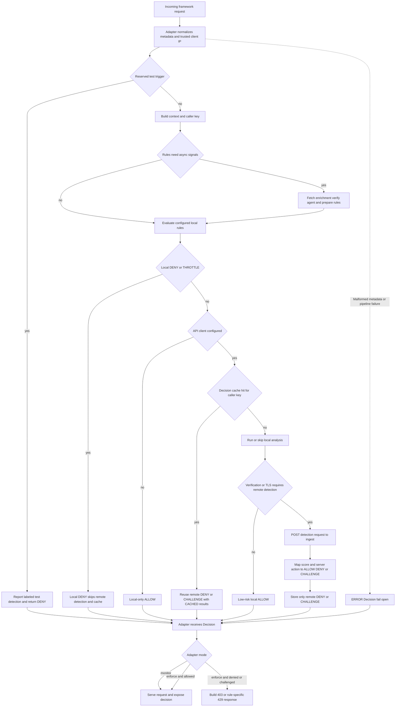

`WebDecoy.protect()` is the framework-independent decision engine. Adapters are responsible for safely extracting request data and for writing framework responses; the SDK owns the protection pipeline, including rule evaluation, optional analysis and ingest detection, the typed `Decision`, and error semantics. This separation is important: an application should make a protection decision once, then choose whether and how that decision changes the response.

## Entrypoints and normalized request data

The primary entrypoint is:

```ts
const decision = await webdecoy.protect(metadata, options);
```

`metadata` is `RequestMetadata`: method, path, required client IP, headers, timestamp, and optional user agent, query, body, and TLS information. Framework adapters turn their native request into this form. In particular, they retain the raw query separately because a routed path frequently excludes it, and they do **not** buffer a request body automatically: supplying `body` is an application choice so protection does not alter streaming behavior.

Correct client IP extraction is part of the security boundary. The Node adapters either use the framework's configured trusted-proxy handling or an explicit `trustProxy`/`getIP` policy; fetch-shaped and edge adapters use a trusted-hop policy because they may not have a peer socket. Do not treat a client-provided forwarding header as an identity without configuring the proxies that are allowed to have appended it.

Before evaluation, the SDK creates one `RuleContext` for the request. It includes normalized request fields plus an edge verdict parsed from WebDecoy edge headers, declared user-agent classification, and a caller key. The key defaults to IP, but `characteristics` can derive it from fields such as an API key or tenant identity. If a configured characteristic is missing or throws, derivation falls back to IP instead of merging all incomplete requests into a shared empty bucket. A keyed rule may still override this SDK-wide key with its own `keyBy`.

## Request lifecycle



This diagram shows the decision boundary: local rules always precede cache lookup and remote detection, while monitor/enforce is an adapter policy applied after a `Decision` exists. `ERROR` is deliberately a third path from a positive allow and reaches the adapter as an allowed, but diagnosable, result.

### Local rules run first

The SDK evaluates configured rules before it considers cached or remote detection. Rules are evaluated in configured order; the **first non-dry-run** `DENY` or `THROTTLE` supplies the engine action, though the engine continues through the configured rules to retain a complete result list and violations. A local `DENY` or `THROTTLE` becomes a `Decision` with conclusion `DENY`, a synthesized block detection response, and no detection API call. It is not cached: rate-limit counters must be advanced for every request and tripwire hits must remain reportable.

If no `rules` option is supplied, the SDK enables `tripwire()` by default; set `rules: []` to deliberately disable rules. Omitting `apiKey` does **not** disable local rules: it puts the SDK in local-only mode. An API key creates the remote client, enables the relevant enrichment path for filter rules, and enables backend violation reporting when rules exist.

Some rules need values that cannot be produced synchronously. When the configured set needs IP enrichment, Web Bot Auth verification, or a rule-specific network store, `protect()` first builds an asynchronous context. Enrichment and agent verification are placed on that context, and all rule `prepare()` hooks run concurrently; synchronous `evaluate()` calls then retain a common rule interface. Calling `evaluateRules()` directly does not perform that preparation—use `protect()` or `evaluateRulesAsync()` for rules requiring remote state.

### Rule outcome states are evidence, not just enforcement

`Decision.results` is a per-rule audit trail. It distinguishes the following states:

| State | Meaning | Enforcement effect |
| --- | --- | --- |
| `RUN` | The rule evaluated with the signals it needed. | Its action can decide the request. |
| `DRY_RUN` | The rule matched and its would-be `DENY` is recorded, but its action is made `ALLOW`. | Never decides the request; a violation can still be reported. |
| `NOT_RUN` | Evaluation could not be meaningfully performed because a prerequisite signal was absent. | Does not decide the request. |
| `CACHED` | The SDK reused a prior remote decision rather than evaluating the result represented by that decision again. | The cached `DENY` or `CHALLENGE` remains the outcome. |

A `DRY_RUN` result can therefore have `conclusion: 'DENY'` while the overall decision remains `ALLOW`; it answers “what would this rule have blocked?” rather than “what did the SDK enforce?” A `NOT_RUN` result is also not an allow. For example, an `ip.*` filter with no enrichment returns `ALLOW` as its raw action but is labeled `NOT_RUN`, so an operator can distinguish “checked and did not match” from “could not be checked.” Similarly, an asynchronous rate-limit store that was not prepared reports `NOT_RUN` rather than silently appearing healthy.

Rule violations are passed to the reporter when rules generate them. The reporter batches events on an interval or at a buffer threshold, sends batches of at most 100, and drops a failed batch rather than affecting request serving. Call `await webdecoy.destroy()` at orderly shutdown to destroy rule resources and flush the remaining violation buffer.

## Local analysis and remote detection

After locally enforcing rules, an instance with an API client checks the decision cache and then performs lightweight local analysis unless `skipLocalAnalysis` is set. The analysis marks suspicious user agents or missing common browser headers, missing `Sec-CH-UA`, and known IPv4 datacenter ranges; these contribute 30, 20, and 40 points respectively, capped at 100. It also records context flags such as minimal headers and a missing referer.

Local analysis requests remote verification for scores of at least 30 or when TLS information is available. TLS fingerprinting is enabled by default, so TLS metadata also causes a remote call when that setting remains enabled. `skipLocalAnalysis: true` creates an analysis record marked `local_analysis_skipped` and forces verification. Conversely, a request that neither needs verification nor has TLS fingerprinting enabled is allowed locally when its score is below 50; no remote request is made.

Remote detection receives both `request_metadata` and `local_analysis` at `POST /api/v1/sdk/detect`, authenticated with the configured bearer API key. The HTTP client uses `fetch`, an abort timeout (default 5 seconds), and the default ingest base URL `https://in.webdecoy.com`. Timeout, connection, authentication, rate-limit, and non-success responses are converted to errors for the decision pipeline rather than being treated as an authoritative verdict.

The remote response has a service action (`allow`, `block`, or `challenge`) and confidence. The SDK applies the per-request `threshold` if provided, otherwise `threatScoreThreshold` (default 80): a service `allow`, or any confidence below the threshold, produces `ALLOW`; a qualifying `challenge` produces `CHALLENGE`; every other qualifying block produces `DENY`.

### Reserved installation probe

A User-Agent beginning with `WebDecoy-Test/` is handled before rules and local analysis. The documented probe is:

```sh
curl -A "WebDecoy-Test/1.0" http://localhost:3000/
```

It requests a labeled test detection through ingest and returns `DENY` so enforce mode visibly confirms installation. It is intentionally excluded from the ordinary rule and threshold pipeline. Ingest identifies such traffic as test traffic and excludes it from normal stats, billing, scoring, and enforcement. In monitor mode, the adapter still serves the request; without an API key the local decision remains a denial but carries an error explaining that no dashboard report was possible.

## Decision contract and cache boundary

`protect()` returns a `Decision`, exported both as a value and through the `ProtectResult` shape. It carries a random `dec_` identifier, `conclusion`, `allowed`, `reason`, `error` where appropriate, every rule result, the raw rule-engine result, the detection payload, caller key, optional agent verdict, edge verdict, and reuse TTL. The edge verdict is attached to every outcome; `edge.present: false` means the request was not seen through the edge, not that it was proven benign.

The four conclusions are `ALLOW`, `DENY`, `CHALLENGE`, and `ERROR`:

- `ALLOW` means the pipeline reached a non-blocking verdict.
- `DENY` is a rule refusal, test trigger, or qualifying remote block.
- `CHALLENGE` is a qualifying remote `challenge` response and gives an adapter or application a distinct route to a captcha flow.
- `ERROR` means no verdict was reached, such as malformed metadata or a failed detection call.

**`ERROR` is distinct from `ALLOW` even though `allowed` is `true` for both.** `allowed` preserves compatibility with fail-open middleware: it is true for `ALLOW` and `ERROR`, and false for `DENY` and `CHALLENGE`. Use `conclusion`, `isAllowed()`, and `isErrored()` when the distinction matters—`isAllowed()` is true only for `ALLOW`. Likewise, `deniedBy(name)` only reports an actually run `DENY` rule, not a dry run or a cached historical outcome.

The in-memory decision cache is deliberately narrow. It is keyed by the derived caller key and defaults to 60 seconds and 10,000 entries; it can be disabled with `decisionCache: false`. It stores only remote `DENY` and `CHALLENGE` outcomes, never `ALLOW`, local rule outcomes, or errors. Entries expire on lookup and the bounded insertion-ordered map evicts the oldest entries when full; writing a repeated denied key refreshes its order. A cache hit returns the existing decision with its result states rewritten to `CACHED`. This avoids repeated paid remote lookups for a caller already rejected while ensuring that an allowed caller is re-evaluated and that rate limits and tripwires still see each request.

## Monitor versus enforce and response shaping

The core SDK makes decisions; adapter `mode` determines whether a non-allowed decision changes traffic. The default is `monitor` across the supplied adapters and fetch guard:

- In **monitor** mode, the adapter records/exposes the full decision and continues to the application even for a `DENY`, `CHALLENGE`, or rate-limit throttle. This is the safe rollout setting for observing false positives and would-block volume.
- In **enforce** mode, `DENY` and `CHALLENGE` take the adapter's blocked path. `ERROR` continues because it is allowed by design. Applications can replace the blocked path with `onBlocked` to render a challenge, redirect, or use a domain-specific response.

The framework-neutral `ruleBlockResponse()` supplies the consistent default for rule-enforced responses. A `THROTTLE` becomes HTTP 429 with `Retry-After` and a JSON body containing `retry_after`; a rule `DENY` becomes HTTP 403 with the deciding rule in the body. A remote score decision has no local rule action to name, so the adapters' ordinary blocked response is a 403 with a detection ID unless `onBlocked` overrides it.

Where the observed decision lives is framework-specific. Express and Fastify attach the detection and typed decision to the request; Next middleware forwards its annotations as **request** headers so downstream application code, rather than the browser, sees them; Hono places the decision in its context. The fetch guard's `check()` returns `{ decision, response? }`, where `response` is absent in monitor mode. Treat these annotations as output from the protection layer, not request input: Next middleware removes inbound WebDecoy annotation headers before setting its own values.

## Failure behavior, diagnostics, and operating guidance

The `decide()` portion of `protect()` catches errors, logs a protection error, and returns a synthetic `ERROR` decision with a locally generated allow detection payload, the decision ID, caller key, and error text. Missing `metadata.ip` is one such error. This is intentional fail-open behavior: a detector outage, bad remote response, or enrichment failure must not become an application outage. Framework adapters also catch adapter-level errors and continue by default, while allowing an `onError` hook to observe or customize that behavior.

Use monitor mode before enforcement, especially after changing proxy trust, caller characteristics, the threat threshold, or a new rule. Validate the real route patterns and forwarding chain, not just direct local requests. For horizontally scaled rate limits, use a shared `RateLimitStore`; the default in-memory store is process-local, so separate replicas get separate counters and cold starts reset them.

Optional tracing is injected rather than imported. With a tracer, the SDK emits `webdecoy.protect` and `webdecoy.rules` spans, including decision ID, conclusion, whether it was allowed, deciding rule, rule counts, remote-versus-local indication, and error information. Tracer failures are swallowed so instrumentation cannot break protection. Pair trace decision IDs with detection IDs and the returned rule outcomes when diagnosing a rollout.

## Focused verification

The focused decision tests establish behavior that should not regress when the pipeline changes:

- `decision.test.ts` verifies typed helper behavior, unique IDs and ID correlation, full per-rule result lists, dry-run visibility, `NOT_RUN` filters, cache restrictions, expiration/eviction, and characteristic-key fallback and precedence.
- `tracing.test.ts` verifies both spans and their useful attributes, that an error decision still ends its span, and that hostile or absent tracers cannot affect protection.
- Hono and Next middleware tests demonstrate the default monitor behavior, enforcement response shapes, decision visibility, `Retry-After` on a throttle, and that monitor annotations are passed to the application rather than leaked to clients.

When changing behavior, test the boundary being changed: use a local tripwire or rate-limit rule for deterministic local short-circuiting; stub the detection client for threshold and `CHALLENGE` mapping; exercise a cache hit after an allowed local-rule pass; and assert both `conclusion` and `allowed` for failures so `ERROR` is never accidentally collapsed into `ALLOW`.
