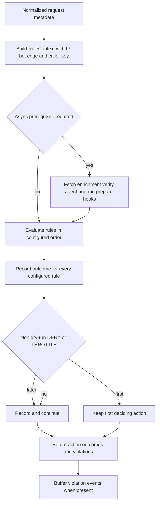

WebDecoy rules are local request controls. They run before cached or remote detection, and they can make a request decision even when no API key is configured. Their value comes from using the right kind of signal for the policy: a rate limit needs a stable caller key and correctly scoped shared state; a tripwire records behavior that an ordinary visitor cannot produce; a bot policy acts on an agent that chose to identify itself; and a filter can combine enriched IP, declared bot, and edge context.

The public factories and exports live in `packages/webdecoy/src/rules/index.ts`: `rateLimit()`, `filter()`, `tripwire()`, `bots()`, `botPolicy()`, `attackSignatures()`, `honeytoken()`, `siteHoneytoken()`, and `upstashRateLimitStore()`. A `WebDecoy` instance accepts rules at construction and exposes `evaluateRules()`, `evaluateRulesAsync()`, and `protect()`; in normal applications, use `protect()` so prerequisites are fetched and violations can be reported. If `rules` is omitted, the SDK installs `tripwire()` by default; use `rules: []` only to explicitly turn rules off.

See [Request Protection, Decisions, and Enforcement Semantics](/openwiki/concepts/request-decisions-and-enforcement.md) for how an engine action becomes a `Decision` and an adapter response, and [Client Identity, Proxy Trust, Characteristics, and Edge Context](/openwiki/concepts/client-identity-proxy-trust-and-edge-context.md) for the security boundary behind `ip` and the derived caller key.

## Rule contract, context, and ordered evaluation

A rule has a unique `name` and a synchronous `evaluate(context)` method that returns `ALLOW`, `DENY`, or `THROTTLE`. Its context contains normalized request data—IP, path, method, lowercase headers, optional query/body, timestamp—and precomputed context such as declared bot classification, edge verdict, caller key, optional IP enrichment, and optional Web Bot Auth verdict. A rule may implement `prepare(context): Promise<void>` for network-dependent work, writing its result to `context.prepared`; this preserves a synchronous evaluation interface for every other rule.



*Rules keep evaluating in order for observability; only the first non-dry-run refusal controls the engine action.*

`RuleEngine` evaluates its configured array in order. The **first non-dry-run** `DENY` or `THROTTLE` supplies the final action, deciding rule, reason, and metadata. Evaluation does not short-circuit: the engine records a `RuleOutcome` for every configured rule, including later matches, allows, dry runs, and rules that could not run. This makes ordering an enforcement decision rather than an observability blind spot. `add()` appends a rule and therefore places it after existing rules; it exists in particular for a site honeytoken whose path is derived asynchronously.

Each outcome has a meaningful state:

| State | Meaning | Can decide engine action? |
| --- | --- | --- |
| `RUN` | The rule ran with its required inputs. | Yes, if it returns `DENY` or `THROTTLE`. |
| `DRY_RUN` | The rule matched, and its would-be denial is visible as the outcome conclusion, but the action is changed to `ALLOW`. | No. |
| `NOT_RUN` | A required signal was absent, such as IP enrichment for an `ip.*` filter or prepared data for an asynchronous store. | No. |
| `CACHED` | A separately cached remote decision was reused by the SDK. | It is not an engine-evaluation state, but is visible on decision results. |

A dry-run outcome is intentionally not equivalent to a passing rule: it has `conclusion: 'DENY'`, `action: 'ALLOW'`, and `state: 'DRY_RUN'`. Use it to learn which traffic a rule would affect before enforcement. Conversely, do not interpret `NOT_RUN` as “allowed and checked.” In the engine itself, a `ViolationEvent` is emitted for a non-`ALLOW` rule action, while all rules always appear in `results`; because built-in dry-run matches return `ALLOW`, their evidence is retained in outcomes rather than as a blocking violation event.

A triggering violation carries rule/action, request IP/path/method/user agent, reason, metadata, dry-run flag, and ISO timestamp. For a `tripwire` violation only, the engine extracts `wd_clearance` from the cookie and forwards it as `clearance`; other heuristic or classification rules must not bind that fingerprint token to a denial. With an API client and rule engine present, `WebDecoy` adds violations to a `ViolationReporter`. The reporter buffers them, flushes every five seconds or at 50 events, splits requests into batches of at most 100, and drops a failed batch rather than affecting request serving. `destroy()` stops the timer, destroys rule resources, and flushes what remains.

### Prerequisites are not all the same

Most controls are **local and keyless**: tripwire matching inspects the path; attack signatures inspect selected request text; and `bots()` reads the locally generated classification of a self-declared User-Agent. They do not require an API key, IP enrichment, or a caller bucket. `filter()` is more general: it parses its expression at construction, failing fast on syntax errors, and evaluates it against the context. A filter that refers to `ip.*` requires IP enrichment and returns `NOT_RUN` with a reason if enrichment is unavailable—for example, without the API-key-backed enrichment client. Filters that use only locally populated `bot.*` or `edge.*` context do not have that IP-enrichment requirement.

Rate limiting is different again: it is local policy with state keyed by a caller. `RateLimitRule` chooses a key in this order: rule-specific `keyBy(context)`, the SDK-derived `context.key`, then `context.ip` for a manually constructed context. SDK characteristics normally derive the key from IP but can represent a tenant, API key, or compound identity; proxy trust and characteristic design therefore affect rate-limit fairness and resistance to evasion. A rule-specific `keyBy` deliberately overrides that SDK-wide choice.

`protect()` determines whether any configured rule needs asynchronous preparation. It fetches IP enrichment and Web Bot Auth verdicts as relevant, then awaits all rule `prepare()` hooks concurrently before synchronous engine evaluation. Direct `evaluateRules()` does not do that work; use `protect()` or `evaluateRulesAsync()` for filters requiring enrichment, Web Bot Auth, or an asynchronous rate-limit store.

## Rate limits: counter ownership, algorithms, and failures

`rateLimit({ max, window, ... })` creates a rule named `rate-limit:<max>/<window>s`. A request consumes one count, including the request that exceeds the budget. It returns current count and reset time in metadata; an exceeded budget defaults to `THROTTLE` but can be configured as `DENY`, and computes `retryAfter` from the reset time. The default algorithm is `fixed`; `sliding` is available.

- **Fixed window:** a key starts a new counter on its first request after the window, counts through `max`, and resets a window duration after that entry's start.
- **Sliding window:** the store retains timestamps within the preceding window, removes expired values, adds the current request, and resets when the oldest retained timestamp leaves the window.

The default `MemoryRateLimitStore` is synchronous and backed by an `InMemoryRateLimiter`. Its maps and cleanup timer are deliberately infrastructure-free, making it suitable for one long-lived process. They are **not shared**: each process or serverless cold start gets fresh counters. In a multi-replica deployment, the effective allowance can become `max × instances`, and autoscaling can change the actual limit. Use a shared `RateLimitStore` for a fleet-wide control.

A store declares `sync`. A synchronous store is consumed inline in `evaluate()`. An asynchronous store is consumed once in the rule's `prepare()` phase and its `RateLimitOutcome` is saved under the rule name in `context.prepared`; `evaluate()` reads that result rather than consuming a second time. This one-consumption invariant prevents each request from double-counting. If an asynchronous store reaches synchronous evaluation without preparation, the rule returns `ALLOW` with `state: 'NOT_RUN'` and an explicit diagnostic instead of silently pretending the limit worked.

### Shared counters with Upstash

`upstashRateLimitStore({ url, token, prefix?, timeout?, onError? })` is the built-in shared-store implementation. It is asynchronous (`sync: false`) and uses HTTP `fetch` against Upstash Redis's `/pipeline` endpoint rather than a socket Redis client, preserving compatibility with edge and serverless runtimes. `url` and `token` are required; keys default to the `wd:rl:` prefix and each request has a 1000 ms default abort timeout.

For a fixed window, Upstash increments a key containing the caller key and window start, then applies `EXPIRE ... NX` so later increments do not accidentally extend the fixed interval. For a sliding window, it trims expired sorted-set entries, adds a timestamp plus random suffix, counts the set, and expires it. The random suffix ensures two requests in the same millisecond remain two entries rather than one overwritten sorted-set member.

Failure policy is explicit, not implicit: `onError: 'open'` is the default and allows a request when Upstash is unreachable; `onError: 'closed'` turns the failed consumption into a disallowed outcome. Both still yield a normal outcome with a reset time rather than pretending the datastore responded. Choose closed only when protecting the resource outweighs availability; use fail-open when a temporary datastore outage must not become a site outage. Monitor datastore errors and the `NOT_RUN` outcome, and validate this behavior in the deployment's actual runtime.

```ts
rateLimit({
  max: 100,
  window: 60,
  store: upstashRateLimitStore({
    url: process.env.UPSTASH_REDIS_REST_URL!,
    token: process.env.UPSTASH_REDIS_REST_TOKEN!,
  }),
})
```

## Tripwires and honeytokens: arm before advertising

`tripwire()` is a deterministic path rule. It normalizes away a query string and fragment, then matches exact paths, configured prefixes, configured regular expressions, and—unless `includeDefaults: false`—the built-in scanner bait paths such as `/.env`, `/.git/config`, `/wp-config.php`, backup files, credentials, and common diagnostic endpoints. It defaults to `DENY`, supports `THROTTLE` and dry run, and reports a 100-confidence hit. A tripwire is appropriate only for paths a real user cannot reach; do not add a reachable application route as bait.

`honeytoken()` supplies the two pieces needed for a manually wired trap: a random (or configured) `/__wd/<token>` path and an off-screen `<a>` pointing to it. Register the path in `tripwire({ paths: [hp.path] })` and inject `hp.linkHtml` into a page. The link uses `rel="nofollow noindex"`, `aria-hidden="true"`, `tabindex="-1"`, and off-screen styling so cooperative crawlers, keyboard users, and assistive technologies do not enter the trap. Its random path is intentionally a per-call developer-wired primitive, not a cross-replica automatic-injection mechanism.

For adapters and multi-process sites, use `siteHoneytoken({ secret, basePath?, rotate?, text? })`. It asynchronously derives a stable 12-hex-character path with WebCrypto HMAC under a site secret. Every process with the same secret computes and arms the same path without coordination or storage. By default it derives a stable label. With `rotate: true`, it advertises today's path and returns both today and yesterday in `activePaths`, retaining a grace window for a crawler that read a page before midnight. Rotation has a cache/clock hazard: a CDN can serve a link older than the armed grace period, silently removing detection. Leave rotation off unless clocks and page cache lifetime make it safe.

The adapter-core arming lifecycle derives the token from the API key, then adds `tripwire({ paths: token.activePaths, includeDefaults: false })` **before** returning the token for injection. If derivation fails, it invokes the optional error callback and does not inject an unarmed link. Async boot-capable frameworks can await `deriveAndArm()`; other adapters can use `armSiteHoneytoken()` and begin injecting only after the derivation settles.

`injectHoneytokenLink(html, linkHtml)` inserts once immediately before the final `</body>`, or `</html>` if no body tag exists. It leaves fragments and documents with no safe closing tag unchanged rather than append invalid markup that a parser might relocate visibly. `isInjectableHtml()` permits only `text/html` (case-insensitive, parameters allowed), so adapters must not corrupt JSON, streams, downloads, or images. `siteHoneytoken` escapes the configurable string-link text; JSX consumers can instead use `linkProps` and let JSX escape its text child.

## Declared bots and published bot policy

`bots()` is the concise enforcement form for user-agent classification. It can match registry categories, agent IDs or display names, all AI categories through `ai: true`, and an `allow` list. Allow-list matching is applied first and wins over broad clauses, preventing an intended exception such as `perplexitybot` from being accidentally denied by `ai: true`. Names and slugs are case-insensitive for configuration convenience. The default action is `DENY`; `THROTTLE` and dry run are available.

This is a policy for **cooperative, self-declared** agents, not a bot detector. An unrecognized User-Agent, including a client spoofing a browser, is allowed. A match carries confidence 70 rather than tripwire-grade certainty because it repeats a declaration, whereas a hidden-path request evidences behavior. Pair bot rules with tripwires or other controls when adversarial clients are in scope.

`botPolicy()` avoids drift between voluntary crawler instructions and local enforcement. It resolves `deny` tokens—categories, names/slugs, or the `ai` shorthand—against `BOT_REGISTRY` once, excluding `allow` entries. `policy.rule()` creates a corresponding `BotRule`; `policy.robotsTxt()` emits a `User-agent` / `Disallow: /` group for that same resolved set. The generated file can also include a sitemap, crawl delay, common wildcard disallows, and a wildcard allow group.

`robots.txt` is only a request. `policy.unenforceable` identifies matched operators that do not document honoring it, and the default generated comments name them so the published policy explains which lines need the rule to be effective. Do not use the file as proof of enforcement, and do not use the local rule as proof that a client presenting an arbitrary User-Agent is that bot.

## Attack signatures: useful boundary, not a WAF

`attackSignatures()` detects a small curated set of unambiguous payload forms: SQL injection patterns, inline script and event-handler XSS patterns, multi-segment traversal and sensitive paths, shell injection/subshells, and template/JNDI expressions. It is intentionally **not a WAF**. It should remain a narrow, cheap set of signatures with a high confidence threshold, composed with other deterministic evidence such as a tripwire, rather than expanding into broad payload classification with ordinary-traffic false positives.

By default it inspects only `path` and `query`, where the selected signatures are intended to lack an innocent reading. `body` and `headers` are opt-in through `inspect`; the `cookie` header is excluded even when header inspection is enabled because opaque application cookies can match coincidentally. Start any body/header rollout in `dryRun: true`, inspect its `DRY_RUN` outcomes, then exclude unsuitable signature IDs or adjust the policy before blocking. A CMS article body, a JSON template, or a URL stored in a parameter can legitimately resemble an attack.

The rule defaults to `DENY` but supports `THROTTLE`, `dryRun`, `exclude`, and `maxBytes` (default 8192 per inspected part). It truncates before matching and attempts percent decoding at most twice, which catches ordinary and double-encoded payloads while bounding attacker-controlled work. The regex set is designed without nested quantifiers; keep that performance invariant when changing signatures. A match returns the signature ID, human-readable label, and location such as `query` or `header:x-api-version`, which makes dry-run review and an `exclude` decision auditable.

## Configuration and rollout checklist

1. Put rules in intentional order. Earlier enforced refusals decide the response, but later rules still execute and can produce outcomes or violations.
2. Begin new filters, bot restrictions, payload body/header inspection, and uncertain tripwire additions in `dryRun`. Review `DRY_RUN` and `NOT_RUN`, not merely final `ALLOW` counts.
3. Use `protect()` (or `evaluateRulesAsync()`) when a rule needs enrichment, verification, or an async store. Treat an async-rate-limit `NOT_RUN` as an integration defect.
4. Choose the rate-limit key to match the resource. Verify proxy trust before using IP buckets; choose characteristics or `keyBy` for authenticated tenants or API consumers.
5. Replace process-local counters with a tested shared store before horizontal scaling. Deliberately choose Upstash `onError` behavior and alert on dependency failure.
6. For a honeytoken, ensure the same secret is available to every replica, arm every `activePaths` value before injection, and inject only complete HTML. Confirm that CDN caching and rotation cannot advertise expired paths.
7. Treat `bots()` and `robots.txt` as declared-identity policy, not attacker attribution. Use tripwires for behavior-based detection.
8. Keep `attackSignatures()` narrow. Test representative normal content and hostile payloads; body and header inspection should begin in dry-run.

## Focused regression tests

The focused tests establish the invariants worth preserving when extending these controls:

- `attack-signatures.test.ts` covers representative signatures, single/double percent encoding, ordinary query/path non-matches, opt-in body/header behavior, cookie exclusion, `exclude`, dry run, throttle, byte truncation, and hostile-input cost.
- `rate-limit-store.test.ts` proves default synchronous limiting, one shared async budget across SDK instances, exactly one consumption per request, characteristic key behavior, `NOT_RUN` without preparation, Upstash fixed/sliding mechanics, credentials, and explicit fail-open/fail-closed errors.
- `tripwire.test.ts` checks built-in and custom traps, path normalization, prefix/pattern support, dry run, hidden-link properties, and end-to-end violation creation; `rule-engine.test.ts` verifies that only a tripwire forwards `wd_clearance`.
- `honeytoken-site.test.ts` verifies stable secret-derived paths, active-path rotation grace, accessibility/robots attributes, safe HTML injection, content-type refusal, escaped text, and JSX props.
- `bot-rule.test.ts` verifies category/AI matching, exceptions, unknown-UA allowance, confidence boundary, dry run, and filter composition; `bot-policy.test.ts` verifies that the generated `robots.txt` and enforcing rule resolve the same agent set.

When a rule changes, test the observable result list as well as the final engine action. The safety properties here are often in the distinction between `DRY_RUN`, `NOT_RUN`, and `RUN`, in a shared versus process-local counter, or in whether a decoy was armed before it was advertised.
