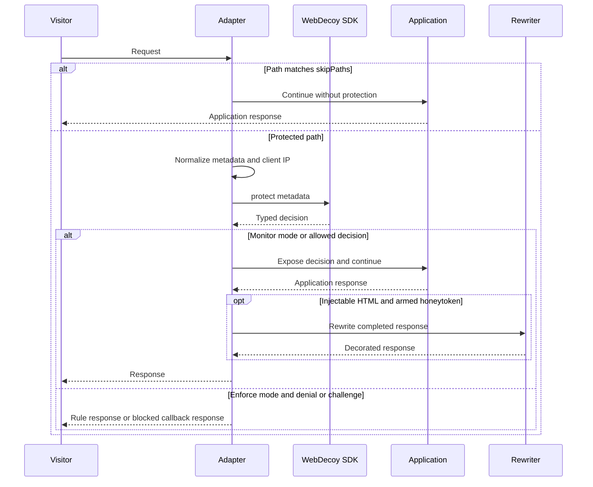

WebDecoy adapters have one job at each framework boundary: normalize a request into SDK metadata, run `WebDecoy.protect()`, expose its resulting decision to downstream application code, and—only when configured to enforce—write a native blocking response. They do not change the SDK's decision semantics. The portable alternative, `createFetchGuard()`, supplies that same boundary for any runtime that accepts a WHATWG `Request` and returns a `Response`.

This page is about the integration contract. For the meaning of conclusions, rule outcomes, and the monitor/enforce policy, see [Request Protection, Decisions, and Enforcement Semantics](/openwiki/concepts/request-decisions-and-enforcement.md). For the complete proxy threat model, see [Client Identity, Proxy Trust, and Edge Context](/openwiki/concepts/client-identity-proxy-trust-and-edge-context.md).

## Choose an adapter and install at the right boundary

| Application boundary | Package and public entrypoint | Native lifecycle | Primary decision surface |
| --- | --- | --- | --- |
| Express on Node | `@webdecoy/express`: `webdecoy()` | Express middleware | `req.webdecoyDecision` |
| Fastify on Node | `@webdecoy/fastify`: default export or `webdecoyPlugin` | Registered plugin with a `preHandler` hook | `request.webdecoyDecision` |
| Next.js Edge middleware | `@webdecoy/nextjs`: `withWebDecoy()` | `middleware.ts` wrapper returning `NextResponse` | Request headers forwarded to the Next application |
| Next.js Pages API route | `@webdecoy/nextjs`: `withBotProtection()` | Per-handler higher-order wrapper | `req.webdecoyDecision` on an allowed request |
| Hono on Workers, Bun, Deno, or Node | `@webdecoy/hono`: `webdecoy()` | Hono middleware | `c.get('webdecoyDecision')` or `c.get('webdecoy')` |
| Any WHATWG fetch handler | `@webdecoy/node`: `createFetchGuard()` | Explicit `check()` and optional `decorate()` calls | Returned `GuardOutcome.decision` |

All supplied adapters construct a `WebDecoy` instance at installation/registration time and turn framework data into method, path, IP, user agent, headers, raw query, and timestamp. The raw query is deliberately retained separately so `attackSignatures()` can inspect payloads that are absent from a framework's routed pathname. None of these adapters automatically read or buffer an incoming request body for rule inspection; preserving request streaming is more important than implicitly enabling body inspection.

### Safe registration order

Install after every body parser required by the endpoints you mount, and before the application routes that should be protected. In Express, this is mandatory for `webdecoyCaptcha()`, whose normalized handler receives `req.body`; Fastify parses JSON itself before handlers. A typical Express ordering is:

```typescript
import express from 'express';
import { webdecoy, webdecoyCaptcha } from '@webdecoy/express';
import { rateLimit, tripwire } from '@webdecoy/node';

const app = express();

app.use(express.json());
app.use(webdecoyCaptcha({ secret: process.env.WEBDECOY_SECRET }));
app.use(webdecoy({
  rules: [tripwire(), rateLimit({ max: 100, window: 60 })],
  skipPaths: ['/health', '/metrics'],
}));

app.use(applicationRoutes);
```

The omitted `mode` is intentional: **`monitor` is the default and is the correct first-install setting.** It evaluates real traffic, records the decision, and serves the request. Inspect decisions, proxy attribution, and rule outcomes before choosing `mode: 'enforce'`; do not treat an `onBlocked` callback, an API key, or a rule's `dryRun` setting as a substitute for this rollout step. See [Production Rollout and Safety](/openwiki/operations/production-rollout-and-safety.md).

### Common adapter flow



*The adapter owns request/response translation; the SDK owns the decision. Honeytoken rewriting happens only after an application response exists.*

## Decision, enforcement, and skip contract

`ProtectResult` is the full typed verdict: `conclusion`, `allowed`, `results`, `reason`, the detection payload, edge context, and helpers such as `deniedBy('tripwire')`. `webdecoy` is the older **detection response** surface, not a synonym for that verdict. It remains populated for compatibility, but it is narrower: it does not carry the per-rule states, conclusion helpers, or the complete explanation needed for monitoring and application policy. Prefer `webdecoyDecision` in new application code.

In monitor mode an adapter must not turn a rule throttle into a 429 or a denial into a 403. It surfaces the decision and continues. In enforce mode, a local rule `DENY` uses a 403 response that identifies the rule, while a `THROTTLE` uses a 429 response with `Retry-After`; a score-based decision falls through to the framework's default 403 response unless `onBlocked` replaces it. Errors fail open by default, so a protection failure does not become an application outage.

`skipPaths` is an adapter-level bypass, not merely an exemption from a particular rule. A string matches the exact path or its prefix, and a regular expression can match a path. A skipped request does not get an SDK decision, request annotation, or automatic honeytoken response rewrite. Use it sparingly for health checks, metrics, and paths that cannot safely pass through the protection pipeline.

### Framework-specific enforcement and decision exposure

| Surface | Monitor behavior and annotation | Enforce behavior and extension point | Compatibility note |
| --- | --- | --- | --- |
| Express | Sets `req.webdecoy`, `req.webdecoyDecision`, and `req.webdecoyEdge`; monitor also records `webdecoyWouldBlock`. | A local rule response is sent directly. Otherwise `onBlocked(req, res, detection, next, decision)` runs; call exactly one of `next()` or a response method. | `req.webdecoy` is the legacy detection-only property; keep it only for existing consumers. |
| Fastify | Sets `request.webdecoy`, `request.webdecoyDecision`, and `request.webdecoyEdge`. | A local rule response is sent through `reply`; otherwise `onBlocked(req, reply, detection, decision)` can shape the reply. | The registered plugin decorates the legacy `webdecoy` and edge properties; the typed decision is the stable cross-adapter API. |
| Next Edge | Returns `NextResponse.next({ request: { headers } })`; in monitor it forwards `x-webdecoy-decision`, `x-webdecoy-detection-id`, and `x-webdecoy-would-block` **to the application request**. | Returns the shared rule response or `onBlocked(req, detection, decision)`, which returns a `NextResponse`. | It deletes client-supplied `x-webdecoy-*` annotations first and does not expose them as browser response headers. |
| Hono | Stores the `Decision` under both `WEBDECOY_CONTEXT_KEY` (`'webdecoy'`) and `'webdecoyDecision'`. | Returns the guard response, or awaits `onBlocked(c, decision)` when supplied. | Hono is a thin framework mapping over the fetch guard. |
| Direct fetch | `await guard.check(request)` always returns a decision and no response in monitor mode. | In enforce mode, `outcome.response` is the response to return; `onBlocked(request, decision)` can build it. | The caller, not the guard, owns continuation to its handler and must retain the returned decision if it needs it later. |

For a Next Edge application, read annotations from the incoming request in a route handler or server component; do not expect them on a response seen by the browser. This separation prevents both a forged request annotation from being trusted and a detection ID or would-block result from being published to the client. Existing edge headers such as `x-wd-class` and `x-wd-clearance` remain forwarded for the application to parse with `getEdgeVerdict()`.

### Next.js has two materially different contracts

`withWebDecoy()` is for Edge middleware. Scope it with Next's module-level middleware configuration, for example `export const config = { matcher: [...] }`. Although `WebDecoyMiddlewareOptions` declares a `matcher` field, the wrapper implementation does not consume that option; do not rely on `withWebDecoy({ matcher: ... })` to limit execution. Use Next's exported matcher and `skipPaths` for the distinct scoping mechanisms they are.

`withBotProtection()` is the Pages API-route compatibility wrapper, not the Edge middleware in another form. It runs on Node and therefore has a socket peer available for its safe proxy default. It protects the wrapped handler with `blockThreshold` (default 80), blocks immediately when the result is not allowed, attaches `req.webdecoy` and `req.webdecoyDecision` only on the allowed path, and fails open on an exception. It does not implement the Edge wrapper's monitor mode, `skipPaths`, or `onBlocked` callback contract. Use `withWebDecoy()` for an Edge middleware boundary and the Pages wrapper only where a Pages API handler is the actual integration boundary.

## Client IP and proxy defaults

IP feeds rate-limit buckets, rule context, reports, and remote detection. A forwarding header becomes useful only after the deployment identifies the controlled proxies that wrote it. The common resolver walks `X-Forwarded-For` from the right, rather than trusting a client-controlled leftmost value. An explicit `getIP` overrides adapter and `trustProxy` behavior, which makes it a security-sensitive extension point: return a validated platform address, not a raw client header.

| Surface | Default when adapter `trustProxy` is omitted | Override and operational consequence |
| --- | --- | --- |
| Express `webdecoy()` and `webdecoyCaptcha()` | Defers to `req.ip`, which follows Express `app.set('trust proxy', ...)`; absent framework configuration, it uses the socket peer. | Set adapter `trustProxy` to override WebDecoy alone, or configure Express once. A proxied app with neither setting attributes everyone to the proxy. |
| Fastify `webdecoyPlugin` | Defers to `request.ip`, which follows Fastify's server `trustProxy` setting or the socket peer. | Set Fastify's server `trustProxy` or the plugin's `trustProxy`. The captcha plugin uses `request.ip`, so its behavior follows Fastify server configuration. |
| Next Edge `withWebDecoy()` and App Router captcha | Defaults to one trusted hop because this fetch-shaped runtime has no socket peer. | `1` fits a single platform proxy; declare the real depth, or use `'cloudflare'` only when origin ingress is locked to Cloudflare. |
| Next Pages `withBotProtection()` | Defaults to no trusted forwarding headers and uses the Node peer. | Set `trustProxy` for a known Pages deployment topology. Do not copy the Edge default blindly. |
| `createFetchGuard()` and Hono | Defaults to one trusted hop; `check(request, peer)` optionally receives a runtime-provided peer. | Supply actual topology or a trusted `getIP`; Hono has no portable peer accessor and delegates its choice to the guard. |

Use a positive hop count only for a fixed topology. For variable controlled proxy paths, use proxy CIDRs; for Cloudflare, `'cloudflare'` selects `CF-Connecting-IP` but is safe only when direct origin requests cannot forge that header. Under-trusting collapses visitors behind a proxy into one rate-limit bucket. Over-trusting lets a caller choose the address that drives IP-keyed limits and attribution. See [Client Identity, Proxy Trust, and Edge Context](/openwiki/concepts/client-identity-proxy-trust-and-edge-context.md) before enforcing an IP-based rule.

## Honeytoken response handling is deliberately runtime-specific

With an API key, automatic honeytokens default to enabled unless `honeytoken: false` is supplied. Each supported automatic path derives a site-stable token from the key and arms the exact tripwire paths before advertising the hidden link. Stable derivation matters across replicas: a random link generated by one process could otherwise reach another process that never armed it.

Response rewriting is constrained by framework mechanics. It must not make a valid application response corrupt merely to add an anchor.

| Runtime surface | What can be rewritten | Deliberate limits and failure behavior |
| --- | --- | --- |
| Express | Full HTML responses intercepted through `res.write` and `res.end`, including chunked responses whose headers were committed without a `Content-Length`. | Non-HTML remains untouched. Once a content length is committed, it cannot safely grow the body, so it leaves it alone. Buffered output gets a corrected `Content-Length`; any rewrite error falls back to the original write. |
| Fastify | Buffered string or `Buffer` HTML payloads through the supported `onSend` hook. | JSON and non-HTML are untouched. Streams are not buffered; the plugin leaves them intact and logs one warning per process with markup for manual placement. Fastify recomputes length for the replacement payload. |
| Hono and direct fetch | `guard.decorate(response)` reads an unused injectable HTML `Response`, injects the link, and rebuilds it without the stale length header. Hono calls this automatically after `await next()`. | It returns non-HTML, body-used, token-not-ready, or failed-read responses unchanged. A direct fetch integration must call `decorate()` itself. |
| Next.js | No automatic middleware response rewrite. | App Router responses can be streamed RSC output after middleware, so middleware cannot safely obtain and rewrite a complete document. Use `honeytokenLink()` and render its `linkProps` in application markup while configuring a matching `tripwire`. |

Express, Hono, and the fetch guard begin asynchronous WebCrypto token derivation without delaying startup, so a request arriving before it settles has no injected link. Fastify awaits the same derivation during async plugin registration and therefore has no early-request window. In all cases, absence of an API key or `honeytoken: false` means no automatic link.

For Next.js, `honeytokenLink(apiKey)` is cached per key/options and returns `SiteHoneytoken`, including `linkProps` and active paths. Rendering it as JSX rather than raw HTML keeps the link and manually configured `tripwire({ paths: bait.activePaths, includeDefaults: false })` aligned without buffering a streamed response.

## Hono and direct WHATWG fetch integration

Hono uses the core guard rather than a separate protection implementation: it checks skips before `guard.check(c.req.raw)`, exposes the decision on the context, returns any blocked response, calls downstream middleware, and then asks the guard to decorate the completed response. This gives Workers, Bun, Deno, and Node Hono deployments the fetch-runtime policy with Hono-native context and response callbacks.

For another fetch runtime, `FetchGuard.check()` does **not** apply `skipPaths` by itself; `skips()` is exposed so the framework integration can decide whether to call `check()`. Preserve that ordering and explicitly decorate only an application response that was allowed to proceed:

```typescript
import { createFetchGuard, rateLimit, tripwire } from '@webdecoy/node';

const guard = createFetchGuard({
  rules: [tripwire(), rateLimit({ max: 100, window: 60 })],
  skipPaths: ['/health'],
});

export default {
  async fetch(request: Request): Promise<Response> {
    const pathname = new URL(request.url).pathname;
    if (guard.skips(pathname)) return handle(request);

    const outcome = await guard.check(request);
    if (outcome.response) return outcome.response;

    console.log(outcome.decision.conclusion);
    return guard.decorate(await handle(request));
  },
};
```

The example remains in monitor mode by default. If an application later elects to enforce, the same continuation pattern is used: a `response` means the guard has already selected the blocking response, while the `decision` is available for logging, metrics, or a custom `onBlocked` implementation.

## Captcha endpoint mounting

The captcha adapters translate native requests to the shared `createCaptchaEndpoints()` handler. The normalized service owns the four routes under `/__webdecoy` by default: `GET /challenge`, `POST /verify`, `POST /score`, and `POST /token/verify`. It returns `null` for unrelated paths so an adapter can fall through, and returns a structured JSON response for matching paths. Set `basePath` consistently with the browser client configuration.

| Framework | Public captcha surface | Mounting contract |
| --- | --- | --- |
| Express | `webdecoyCaptcha(options)` | Mount after `express.json()` and before relevant routes. It falls through to `next()` for a non-captcha path and routes rejected async work to Express error middleware. Its `trustProxy` option has the same semantics as Express protection middleware. |
| Fastify | `webdecoyCaptchaPlugin` | Register the plugin; it declares `GET` and `POST` routes beneath the endpoint base path. Fastify supplies parsed JSON and `request.ip`, so set Fastify's server `trustProxy` if needed. |
| Next.js App Router | `createCaptchaHandler(options)` | Create `app/__webdecoy/[...webdecoy]/route.ts` and export its returned `GET` and `POST` handlers. It parses POST JSON defensively and defaults to one trusted hop. |

```typescript
// app/__webdecoy/[...webdecoy]/route.ts
import { createCaptchaHandler } from '@webdecoy/nextjs';

export const { GET, POST } = createCaptchaHandler({
  secret: process.env.WEBDECOY_SECRET,
});
```

Captcha endpoints score and rate-limit by resolved IP, so their proxy setting must match the protection boundary. For invisible-score enforcement, supply the same `signalStore` to `createCaptchaEndpoints()` (through its framework adapter) and to `clientSignals()` in normal protection middleware; otherwise the score returned to the browser is not a later-request rule input. The browser/session handoff and production persistence requirements are covered in [Self-Hosted Captcha and Browser-Signal Decision Flow](/openwiki/concepts/captcha-and-browser-signals.md).

## Export reference and focused verification

The package entrypoints deliberately expose core types such as `WebDecoyConfig`, `RequestMetadata`, `SDKDetectionResponse`, and `ProtectResult` alongside their native adapters. `@webdecoy/nextjs` additionally exports `getEdgeVerdict`, `honeytokenLink`, and `createCaptchaHandler`; `@webdecoy/hono` exports `WEBDECOY_CONTEXT_KEY`, `FetchGuardOptions`, and `Decision`; Express exports `ExpressCaptchaOptions`; Fastify exports both its default plugin and named `webdecoyPlugin`.

When changing an adapter or adding a new one, test the actual framework boundary rather than only the SDK result:

- Exercise monitor mode with a deterministic `tripwire()` and assert that application code sees the full decision while the original route still runs.
- Exercise enforce mode separately for a rule denial and a throttle, including the 429 `Retry-After` header and each framework's blocked callback contract.
- Assert that a forged leftmost `X-Forwarded-For` cannot create new rate-limit buckets; then test the declared proxy topology and framework-native trust setting.
- For response rewriting, assert that HTML gets one usable link, JSON and plain text remain byte-valid, content length remains valid when applicable, and streaming behavior is preserved or visibly reported.
- For Next, assert request-header forwarding rather than response-header mutation, and for direct fetch assert that the integration calls `skips()` and `decorate()` in the correct places.

The repository's Express and Fastify honeytoken integration tests cover injection position, JSON/text preservation, content-length safety, an armed advertised path, replica-stable derivation, and their distinct streaming behavior. Hono tests cover monitor decision visibility, custom blocks, query inspection, and response decoration; Next tests cover request-only annotation forwarding, forged-header removal, skip short-circuiting, monitor behavior, and edge verdict parsing.
