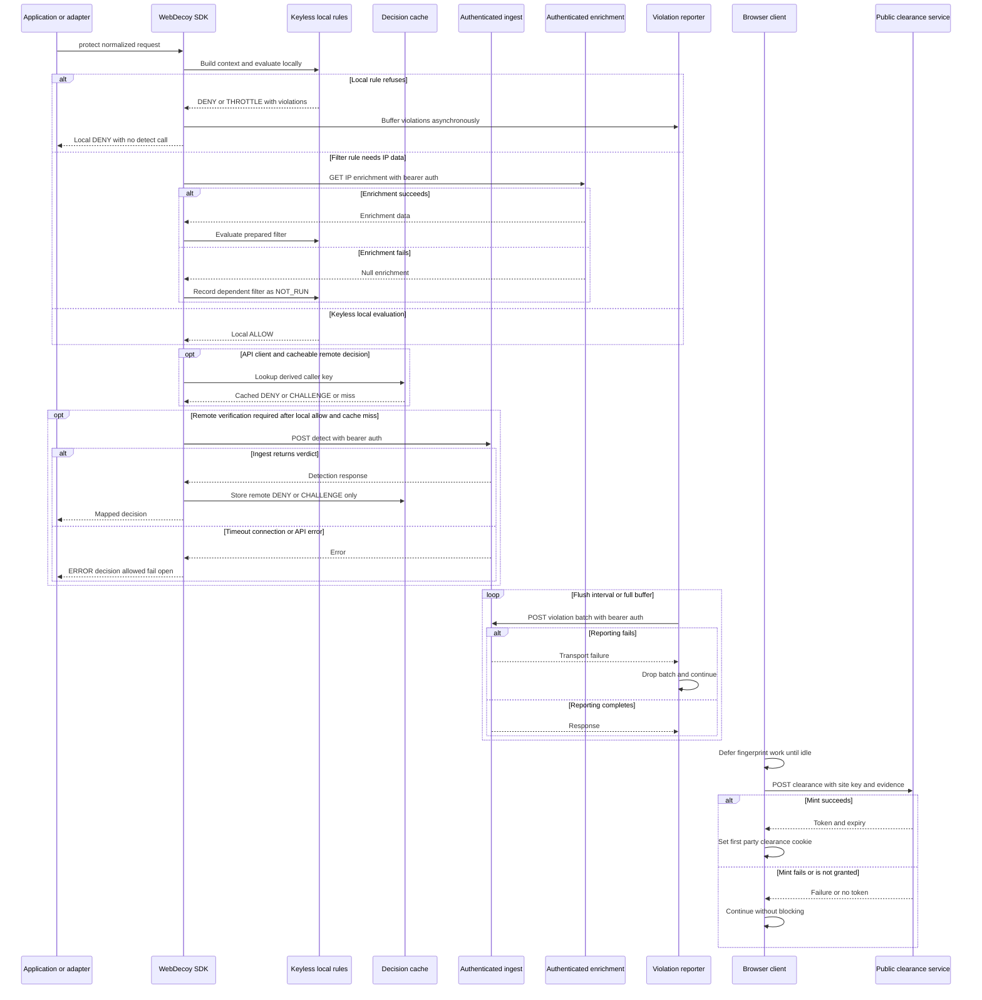

WebDecoy has deliberately different network boundaries for request protection, rule telemetry, and browser clearance. A `WebDecoy` instance without an API key remains useful: it evaluates local rules and can make local decisions without contacting a WebDecoy service. Supplying an API key creates the server-side `WebDecoyClient`, which can authenticate detection requests, enable enrichment for eligible rules, and send rule violations in the background. The browser clearance client is a separate, public issuance flow: it uses a site key and browser evidence, not the server SDK's bearer credential.

This page documents those contracts and their availability semantics. For the larger decision pipeline, see [Request Protection, Decisions, and Enforcement Semantics](/openwiki/concepts/request-decisions-and-enforcement.md); for local rule behavior and what a violation means, see [Rules, Shared State, Honeytokens, and Attack-Signature Boundaries](/openwiki/concepts/rules-rate-limits-and-deception.md); for browser captcha and signal collection, see [Self-Hosted Captcha and Browser-Signal Decision Flow](/openwiki/concepts/captcha-and-browser-signals.md).

## Service roles and authentication boundary

| Path and caller | Role | Authentication and data boundary | Effect of failure |
| --- | --- | --- | --- |
| `POST /api/v1/sdk/detect` from `WebDecoyClient` | Ask ingest for a server detection verdict after the SDK has decided that remote verification is required. | JSON request metadata plus local analysis; bearer authentication from the configured server API key. | The protection pipeline produces an `ERROR` decision, which is allowed through by default (fail open). |
| `GET /api/v1/sdk/ip/{ip}/enrichment` from `WebDecoyClient` | Obtain IP attributes used by `filter()` expressions that reference `ip.*`. | Same authenticated server client; the address is URL encoded. | Returns no enrichment; the dependent filter reports `NOT_RUN` rather than pretending it passed. Protection otherwise continues. |
| `POST /api/v1/sdk/violations/batch` from `ViolationReporter` | Upload rule-violation telemetry after a local rule has evaluated. | Same authenticated server client; JSON `{ events }`. | Best effort only: events may be dropped and serving is unaffected. This is not a protection fail-open decision. |
| `POST /api/v1/clearance` from `@webdecoy/client` | Ask the public clearance service to mint or upgrade a browser clearance token. | Browser JSON includes a site key, fingerprint, scope, browser claims, and optional behavior aggregate. This request has no server bearer authorization header. | The browser simply retains its existing state or proceeds without a token; it never blocks paint, interaction, or the application request. |

The server SDK defaults its ingest base URL to `https://in.webdecoy.com`; it removes trailing slashes before constructing paths. The browser clearance module has its own default origin, `https://ingest.webdecoy.com`. Treat these as distinct integration contracts, even if deployment configuration overrides either origin: server-to-server detection, enrichment, and reporting must keep the API key on the server, while a browser receives only the clearance site key and its own collected evidence.

`WebDecoyClient` uses the Web-standard `fetch` API rather than a Node-specific transport, so the authenticated server contract is usable in Node 18+ and edge-style runtimes. It sends JSON, a bearer authorization header, and an SDK user-agent. The legacy `tlsRejectUnauthorized` configuration field does not disable certificate verification in this fetch-based transport; setting it false is ignored (with a debug warning). Configure trust for a development CA in the runtime instead of assuming this SDK option weakens TLS.

## When a protected request reaches the network

`WebDecoy.protect(metadata, options)` does not mean “always call ingest.” It builds a local rule context first and runs rules before it checks the decision cache or performs detection. A local `DENY` or `THROTTLE` is final for enforcement and skips the detection endpoint. If an API key is absent, a locally allowed request returns a local `ALLOW`; local rules, including the default tripwire when `rules` is omitted, still work.

An API key is necessary but not sufficient for a detection call. After local rules allow, the SDK checks the caller-keyed decision cache. On a miss it runs `analyzeRequest()` unless `skipLocalAnalysis` is set. The analysis requests remote verification when its score is at least 30, or when TLS information is present and TLS fingerprinting remains enabled. A low-risk request that needs neither verification nor TLS fingerprinting is allowed locally. `skipLocalAnalysis: true` deliberately constructs an analysis record that forces remote verification.

The detection request contains the normalized `request_metadata` and the local-analysis result. Ingest returns `decision` (`allow`, `block`, or `challenge`), `confidence`, threat information, a detection ID, and rule-enforcement information. The SDK applies the per-call `threshold` or configured `threatScoreThreshold`: an ingest `allow`, or a confidence below the threshold, yields `ALLOW`; an above-threshold `challenge` yields `CHALLENGE`; other above-threshold non-allow results yield `DENY`. The application or framework adapter—not the transport client—decides whether a `DENY` or `CHALLENGE` changes the response in monitor or enforce mode.

*The sequence separates keyless local enforcement from authenticated server calls, and shows that reporting and browser clearance have independent, non-blocking failure paths.*

### Timeout and HTTP-error behavior

Every `WebDecoyClient` request has an `AbortController` and uses the configured timeout, which defaults to 5,000 ms. The timer is unreferenced where the runtime supports it so an idle timeout does not keep a Node process alive. The client reads the entire response as text and attempts JSON parsing; an invalid or empty response body becomes undefined data rather than a JSON parsing exception.

For **detection**, this transport behavior is converted into protection-relevant errors:

- aborts become a timeout error;
- fetch connection and DNS-style `TypeError`s become a connection error;
- HTTP 401 becomes an invalid-key error and HTTP 429 becomes a rate-limit error;
- other HTTP status codes at or above 400 use a service `error` or `message` when present, otherwise a generic HTTP error.

`protect()` catches these errors (as well as malformed metadata and other pipeline failures), logs them, and returns an `ERROR` `Decision`. `ERROR` is intentionally distinguishable from `ALLOW`, but `Decision.allowed` is true for both so existing middleware remains available during a dependency outage. Use `conclusion`, `isErrored()`, logs, and tracing to distinguish an affirmative allow from no reached verdict.

The semantics are intentionally different for the non-decision calls. `getIPEnrichment()` returns `null` for an HTTP status at or above 400 or any thrown transport error, logging only when debug is enabled. `sendViolations()` swallows thrown transport errors after optional debug logging. It does not turn a non-success HTTP response into an exception because it does not inspect the returned status. Neither method retries.

## Enrichment: conditional, cached, and non-authoritative

The SDK creates `IPEnrichmentClient` only when both conditions are true: an authenticated client exists and at least one configured rule name begins with `filter:`. During `protect()`, it retrieves enrichment before evaluating those filters; direct `evaluateRules()` is synchronous and does not perform this preparation, so callers should use `protect()` or `evaluateRulesAsync()` when a rule requires it.

`IPEnrichmentClient` owns a per-instance, in-memory map keyed by IP address. Successful data is cached for one hour by default. Concurrent calls for the same uncached IP share one pending promise, avoiding a request stampede; the pending entry is removed when that promise settles. Failed or empty results are not cached, and `clearCache()` explicitly removes successful entries.

Enrichment is therefore an optimization and an optional rule input, not a source of an enforced outage. When no API key exists, no enrichment client is created. When the service is unavailable, `enrich()` returns `null`; a filter requiring `ip.*` data reports `NOT_RUN` with its diagnostic rather than an invented `ALLOW`. Locally available filter inputs, such as declared-bot or edge context, can still evaluate without IP enrichment. Operators should monitor `NOT_RUN` alongside final decisions: it means a policy prerequisite was absent, not that the policy has established a benign result.

## Remote-denial cache: reduce repeat calls without bypassing rules

The decision cache is another in-process optimization, distinct from enrichment caching. It is checked only after local rules have run and only when an authenticated client exists. Its key is the SDK-derived caller characteristic key (IP by default), and its defaults are a 60-second lifetime and 10,000 entries. Set `decisionCache: false` to remove it.

Only remote `DENY` and `CHALLENGE` decisions are stored. An `ALLOW` is never cached, so a caller that becomes suspicious is evaluated again; locally enforced rule outcomes and `ERROR` decisions are never cached. Rules still run before a cache lookup, preserving rate-limit consumption and tripwire reporting. Cache entries expire on read, use a bounded insertion-ordered map, evict the oldest key at capacity, and refresh insertion order on a repeated denial. A hit returns a copy whose recorded rule states are `CACHED`.

This cache reduces repeated authenticated detection calls for a caller already rejected. It is process-local, so it is not a distributed revocation or shared enforcement system; replicas can disagree during its short TTL.

## Violation reporting is telemetry, not enforcement

A rule engine can create violations even when its decision is local. When both rules and an authenticated client are present, `WebDecoy` automatically installs a `ViolationReporter`; `runRules()` adds each nonempty violation set to it. This is intentionally decoupled from the response path:

- events enter an in-memory buffer;
- the reporter flushes every 5 seconds by default or immediately once the buffer reaches 50 events;
- a flush drains the current buffer, sends sequential batches of at most 100 events, and prevents concurrent flushes with a `flushing` guard;
- timers are unreferenced when supported, so telemetry does not hold the process open;
- `await webdecoy.destroy()` destroys rule resources, stops the timer, and attempts a final flush.

Reporting is **best effort**. A drained batch is dropped when reporting fails; there is no retry, persistence, or impact on the user's request. This is different from protection fail-open: protection fail-open returns an `ERROR` decision when a verdict could not be reached, whereas best-effort reporting deliberately loses telemetry after the local decision has already been made. Also plan for events buffered in memory to be lost on abrupt process termination or serverless suspension; call `destroy()` only during an orderly shutdown and do not treat it as durable delivery.

## API-key validation is a detection call, not an offline credential check

`webdecoy.validateConfig()` returns `{ valid: false, error }` immediately when no server client exists. With a client, it calls `validateAPIKey()`, which sends a minimal request through the ordinary authenticated detection endpoint. An explicit invalid-key error produces `valid: false`. Other failures, including network failures, are treated as `valid: true` because they do not establish that the credential is wrong.

Consequently, validation checks whether the service rejects the supplied credential but is not a complete connectivity or ingest-health probe. It also is not an offline unit-test helper: it deliberately has network side effects. Run it as a controlled integration check and observe its service-side result rather than using it in repeated application tests.

## Browser clearance: a separate public, fail-open lifecycle

`startClearance()` is exported by `@webdecoy/client`. It returns immediately if there is no site key or no `document`, then defers its work with `requestIdleCallback` when available, otherwise a 1,200 ms timer. This keeps fingerprint collection and minting off the initial paint and interaction path. It first checks for the `wd_clearance` cookie; if one is already present, that invocation does not collect or mint a clean token.

For an absent cookie, the client takes one canvas and one WebGL result from `EnvironmentalCollector`, then passes those results to `computeDeviceFP()`. The fingerprint is a SHA-256 hash of the version prefix, canvas and WebGL values, screen dimensions/depth, time zone, platform, and language. It intentionally excludes the browser user agent, which changes with automatic updates, and behavioral/session signals, which vary across page loads. `computeDeviceFP()` consumes already collected canvas/WebGL values rather than doing graphics work itself; unsupported values become `na`. The version prefix is part of the identity contract, so evolve this algorithm by changing the version rather than silently changing its composition.

The mint request carries the site key, fingerprint, scope (empty by default), user-agent, webdriver/headless claims, and optional behavior evidence. A granted response with a token is written as a first-party `wd_clearance` cookie with `path=/`, `secure`, `samesite=lax`, and the service-provided lifetime (falling back to 1,800 seconds if absent). The initial successful mint schedules a later `startClearance()` call shortly before nominal expiry. Because the later call sees the cookie and returns, the currently inspected implementation does not itself re-mint an existing token at that scheduled call; an integration that requires guaranteed renewal should test the actual token-expiry behavior rather than rely on the scheduling comment.

There is no browser-request timeout or retry policy in this module. Any fetch, JSON parsing, fingerprint, or mint failure is caught and returns no minted token. A denied or malformed mint response likewise produces no token. The browser continues normally: clearance issuance is an allow-and-observe optimization, not a browser-side availability gate.

### Behavioral upgrade and privacy boundary

Unless `behavior: false` is supplied, `startClearance()` also registers one page-wide behavioral-upgrade watcher. It waits until it has enough pointer or touch evidence, observes for a short settling period, derives the same device fingerprint, and asks the issuance endpoint to re-mint with a behavior aggregate. A failed upgrade leaves any existing clean token unchanged.

The published aggregate consists only of scalar counts, durations, variances, ratios, and a pointer-modality boolean. It excludes coordinates, keys pressed, form values, page or element content, URLs, screenshots, and replayable event streams. Keyboard-only or otherwise insufficient interaction produces no behavior aggregate, rather than incorrectly treating an accessibility-oriented session as bad evidence. Browser evidence remains client-controlled and probabilistic; the service, not the browser, decides its trust value.

The current guard prevents multiple behavioral watchers per page load, but the clean-mint path is cookie-based rather than a pending-request mutex. Multiple `startClearance()` invocations before the first cookie write can each reach their deferred mint work. Embed or invoke the initializer once per page/application lifecycle, and test that integration if duplicate startup is possible.

## Reserved test trigger: installation verification only

A User-Agent that begins—after leading whitespace and case normalization—with `WebDecoy-Test/` is a reserved installation probe. The documented value is `WebDecoy-Test/1.0`. Matching is prefix-anchored: a normal browser user-agent that merely contains that text later in the string is not a trigger.

The SDK handles this probe **before rules, asynchronous enrichment, local-analysis thresholds, sampling, and the decision cache**. With an API key it always sends a detection request with `test_trigger` analysis data, then returns `DENY` regardless of the returned service verdict so enforce-mode middleware has a visibly different result. Ingest recognizes the prefix as test traffic and labels it for exclusion from normal statistics, billing, actor scoring, and enforcement. In monitor mode, adapters still serve the request even though the SDK decision is a denial. With no API key or an unreachable ingest service, the SDK still returns the local test-trigger denial but includes an error explaining that no dashboard report was completed.

This behavior makes the probe useful for an intentional, one-off post-install check, including from localhost. It also makes it unsafe as a generic test fixture or synthetic-monitor user-agent: it is designed to send dashboard traffic whenever credentials are configured. Do not accidentally use the reserved prefix in unit tests, load tests, uptime checks, browser fixtures, or production traffic generators.

For application tests, import `createTestHarness` from `@webdecoy/node/testing`. It removes an API key unless `allowNetwork: true`, creates fresh local rule state, and uses a silent logger, preventing an ambient deployment credential from turning a unit test into a live detection. Repository tests for the reserved trigger mock `global.fetch`; they verify the exact ingest route and payload without contacting a dashboard. Test ordinary protection behavior with local tripwires, rate limits, or explicitly mocked transport rather than the reserved probe.

## Operating checklist

1. Keep the server API key in server/edge configuration only. Confirm the configured ingest origin is reachable from every runtime and do not substitute the browser clearance origin without understanding the different endpoint contract.
2. Start adapters in monitor mode, then inspect `Decision.conclusion`, errors, rule outcomes, remote-call rate, cache behavior, and `NOT_RUN` enrichment filters before enforcing refusals.
3. Set a timeout consistent with request latency budgets. A detection timeout yields an allowed `ERROR`, not a block; alert on it rather than inferring that traffic is benign.
4. Do not rely on the process-local enrichment or decision cache for fleet-wide consistency. Size the decision cache deliberately if caller cardinality is high, and consider the privacy/retention implications of IP-keyed state.
5. Treat violation delivery as lossy telemetry. Arrange graceful shutdown to call `await webdecoy.destroy()`, but use durable application logging or another pipeline if every security event must be retained.
6. Use `validateConfig()` sparingly as a controlled live integration check. It cannot prove connectivity when it returns valid after a network error.
7. Run the reserved `WebDecoy-Test/` request only deliberately during installation verification. Keep automated tests offline by default and mock `fetch` when asserting authenticated-path behavior.
8. Initialize browser clearance once, assess the behavioral-data contract, and verify clearance minting/expiry behavior in the deployed browser and edge environment. Its failures are intentionally non-blocking.

## Focused regression anchors

The source-level tests most relevant to this boundary are `packages/webdecoy/src/test-trigger.test.ts`, which locks prefix matching, bypass ordering, no-key/unreachable behavior, and mocked ingest payloads; `packages/webdecoy/src/decision.test.ts`, which verifies cache restrictions, expiration, capacity, and caller characteristics; and `packages/webdecoy/src/invariants.test.ts`, which guards shared architectural boundaries such as edge-compatible transport imports.

For clearance, `packages/client/src/clearance.test.ts` pins the versioned device-fingerprint composition, golden hash, unsupported-signal fallback, and no-extra-canvas/WebGL-work invariant. `packages/client/src/clearance-behavior.test.ts` locks the aggregate-only data shape, rejects insufficient and keyboard-only interaction from behavioral scoring, and exercises watcher lifetime behavior. These are the focused tests to update alongside a wire-format, cache, timeout, or browser-evidence change.
