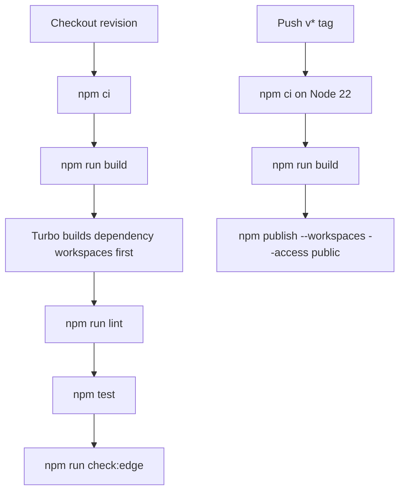

# Monorepo Build, CI, Edge Checks, and npm Release

The repository is an npm-workspace monorepo. The private root package coordinates `packages/*` and `examples/*`; it is not itself published. Root lifecycle commands delegate to Turbo, whereas each workspace owns its build, lint, test, and clean implementation. The authoritative operational contract is the root manifest, `turbo.json`, package manifests, and GitHub workflows—not generated `dist` contents or prose that predates the current automation.

Use npm 10.2.4 as declared by `packageManager`. The root supports Node `>=18`, but the required GitHub CI matrix exercises Node 20 and 22; Node 18 compatibility is therefore a package-engine contract rather than a version currently covered by CI.



This diagram distinguishes the ordered commands in the CI job from the separate tag-triggered publication job. The publish job rebuilds but does not itself run lint, tests, or the edge gate.

## Workspace entrypoints and Turbo lifecycle

Run root commands from the repository root:

| Command | Operational effect | When to use it |
|---|---|---|
| `npm run build` | Runs `turbo run build`. | Before consuming a workspace package or publishing; after changes that affect emitted declarations or package entry points. |
| `npm run dev` | Runs `turbo run dev`; dev tasks are persistent and uncached. | Local watch development for workspaces that define a `dev` script. |
| `npm run lint` | Runs `turbo run lint`, after dependency builds. | Before a PR; catches shared lint policy and package warning budgets. |
| `npm test` | Runs `turbo run test`, after dependency builds. | Before a PR and after behavior changes. |
| `npm run check:edge` | Invokes the core, Next, and Hono workspaces' `check:edge` scripts. | For any change reachable from those edge-targeted source graphs. |
| `npm run clean` | Runs Turbo clean tasks, then deletes the root `node_modules`. | Reset a local install/build state; it is intentionally destructive. |
| `npm run format` | Executes Prettier with `--write` for TypeScript/JavaScript, JSON, and Markdown patterns. | Intentionally rewrites formatting; review its diff before committing. |

Turbo's `^build` dependency expression is the key ordering invariant: a workspace's dependencies build before that workspace's `build`; the same prerequisite applies before its `lint` and `test`. This is important for adapters whose dependency is `@webdecoy/node`: tests and lint run against a build graph in which the core has already been built, rather than relying on a coincidental task order.

Turbo treats `dist/**`, `.next/**` except `.next/cache/**`, and `coverage/**` as cacheable task outputs for the applicable build/test tasks. It also lists `**/.env.*local` as a global dependency, so changing one of those local environment files invalidates relevant cached work. `dev` and `clean` are deliberately non-cacheable; `dev` is additionally persistent. Do not add a build output without updating `turbo.json`, or Turbo may restore an incomplete cached build; conversely, do not treat `.next/cache` as a distributable build result.

The root workspace glob automatically admits directories under `packages/` and `examples/`, but a new workspace participates meaningfully only after it supplies the expected scripts and correct manifest dependencies. In particular, a package depending on another workspace must declare that dependency so Turbo can derive the prerequisite build relationship.

## What a successful build produces

Published packages keep their distribution boundary in the manifest: each allowlists only `dist` in `files` and maps public imports to compiled JavaScript and declaration files. The core builds two public entry points, `src/index.ts` and `src/testing.ts`, as CommonJS and ESM with declarations; the framework adapters build their `src/index.ts` entry the same way. This makes package build validation more than a TypeScript syntax check: it verifies the formats and declaration surface that the `exports` map promises to consumers.

`@webdecoy/client` has the non-standard browser build. Its tsup configuration emits a browser-targeted ES2019 library in ESM and CommonJS with declarations, and separately produces a minified IIFE from `src/global.ts`. The latter is named by tsup as `dist/webdecoy.global.js`, matching the client manifest's `browser` field and `./global` export; it exposes the configured browser global. Treat that output as a build product, not source to edit or a wiki artifact to attach.

The two examples are private workspaces rather than npm packages. Their `build` scripts run `tsc`, while their `dev` scripts run `tsx`; they are still included in root Turbo orchestration because `examples/*` is a root workspace glob. Their dependency versions are `"*"` for local workspace development and are not a public package-version contract. For package roles and public entry points, see [Package Architecture, Public Surfaces, and Runtime Boundaries](/openwiki/architecture/packages-and-runtime-boundaries.md).

## Lint, formatting, and test policy

A single root flat ESLint configuration governs all workspaces; do not add a competing per-package config. It excludes generated and derived locations—`dist`, `node_modules`, `coverage`, `.turbo`, and `*.generated.ts`—so an actionable failure belongs in maintained source or its generator, not a build artifact.

The policy combines recommended JavaScript/TypeScript rules with a small type-aware source-only set: `no-floating-promises`, `no-misused-promises`, `await-thenable`, and `require-await`. Test files are excluded from those type-aware rules and relax `no-explicit-any` and non-null assertion restrictions because tests intentionally construct malformed inputs and inspect internals. In production source, an underscore marks intentionally unused names, equality is strict except for deliberate null checks, and fallthrough is an error.

`@typescript-eslint/no-explicit-any` is a warning with a package-local cap, not an unbounded warning stream. The current caps are: client 25, Express 10, core 9, Next 2, and Fastify/Hono 0. A lint invocation fails if the cap is exceeded. Lower a cap when debt is removed; raising one should be an explicit, reviewed compatibility decision rather than a way to bypass a new warning.

Package tests use Jest and `ts-jest`; their default test roots are `src` and they match `**/*.test.ts`. The client uses `jsdom`, while the core and adapter package configurations use the Node environment. Some adapter scripts include `--passWithNoTests`, but that flag should not be read as a waiver for behavior changes: the current repository contains focused adapter, core, and browser tests. The root `test` command is the required aggregate gate, while a maintainer should run the affected workspace test script first for faster diagnosis.

The repository contains unusually valuable tests that protect cross-package invariants rather than one implementation branch:

- Core edge-runtime tests bundle the core for a browser platform and execute keyless protection, Web Bot Auth verification, and captcha token issue/verify/replay behavior in an Edge Runtime VM. These detect both unresolved Node built-ins and runtime dependence on Node globals.
- The invariant suite scans maintained TypeScript sources to prevent duplicate client-IP resolution, response construction, skip-path matching, and site-honeytoken derivation. It also rejects `node:` imports in core, Next, and Hono source graphs. Preserve this suite when moving shared policy; ordinary unit tests can miss two independently plausible implementations that drift.
- Adapter tests cover lifecycle-sensitive translation, including Express/Fastify honeytoken injection, trusted proxy behavior, Hono middleware behavior, and Next middleware behavior. Run the relevant package test when changing host integration rather than relying solely on core tests.

Prettier is separate from lint and uses the root `.prettierrc`; `npm run format` writes files rather than checking them. CI currently runs build, lint, test, and edge compatibility, but not the format script. A PR should therefore format intentional changes locally before the CI gate.

For application-facing test-harness use and the repository test layout, see [Application and Repository Tests](/openwiki/testing/application-and-repository-tests.md).

## Edge compatibility is a graph gate

`npm run check:edge` is intentionally narrower than the regular build. It dispatches to `@webdecoy/node`, `@webdecoy/nextjs`, and `@webdecoy/hono`; Express, Fastify, the browser client, and examples are not inputs to this root command. A passing normal library build does **not** establish that an import graph can run in an edge runtime.

For every supplied entry, `scripts/check-edge.mjs` asks esbuild to bundle without writing output, with `platform: 'browser'` and ESM format. Node built-ins such as `crypto`, `net`, or `https` consequently fail resolution anywhere reachable in the graph, approximating the failure a Vercel Edge Middleware consumer would encounter. The script keeps host framework imports external (`next`, `express`, `fastify`, `fastify-plugin`, and `hono`) so it evaluates the WebDecoy graph rather than pretending to bundle each host framework.

The failure semantics are deliberate:

- Calling the script with no entry paths prints its usage and exits with status 2.
- It attempts every supplied entry, reports each compatible or incompatible result, and exits 1 if any entry failed.
- It does not write generated bundles, so the check cannot accidentally create publishable artifacts.

Run this gate after changing any transitive import of core, Next, or Hono—not just an obvious middleware entry file. The source-level invariant test complements it by naming a forbidden `node:` import earlier in review; the Edge VM test then proves selected keyless behavior at execution time. Neither check makes the Node-bound Express or Fastify adapters edge-safe, and neither should be bypassed by externalizing a reachable WebDecoy dependency.

## Required GitHub CI matrix

The `CI` workflow runs on pushes to `main` and pull requests targeting `main`. Its sole `build` job uses `ubuntu-latest` and a two-version Node matrix: 20 and 22. Each matrix leg checks out the revision, restores npm's cache through `actions/setup-node`, performs a lockfile-faithful `npm ci`, then runs these commands in order:

```bash
npm run build
npm run lint
npm test
npm run check:edge
```

This means every CI-supported Node version must pass all four gates. The command order makes failures easier to classify—build before static analysis/tests, then the specialized edge gate—but the workflow does not upload artifacts, coverage, or generated distributions. Diagnose failures from the command's output and reproduce with the same root command locally; do not commit `dist` merely to make a CI step appear green.

The lockfile is npm lockfile version 3 and records the root workspace set. Use `npm ci` for reproducible automation and for investigating a CI-only dependency-resolution failure. `npm install` remains a workable local bootstrap command, but it may update the lockfile; inspect such a diff rather than treating it as incidental.

## Tag-triggered npm publication

Publication is a separate `Publish` workflow, triggered only by a pushed Git tag matching `v*`. It runs on Ubuntu with Node 22, configures npm's public registry, executes:

```bash
npm ci
npm run build
npm publish --workspaces --access public
```

The command publishes from the tag's checked-out workspace manifests after a fresh build. It does not calculate versions, create a tag, generate a changelog, or run the full CI quality sequence. Release readiness is therefore established before pushing the tag: make version and changelog changes in the release commit, run the root gates, ensure the desired commit is on `main` under the normal review process, then create and push the intended `v*` tag. Treat the tag as an irreversible publication trigger, not as a request for a dry run.

Authentication is CI-managed configuration only. The workflow supplies npm authentication through the `NPM_TOKEN` GitHub Actions secret and grants the job read-only contents access plus `id-token: write`; maintainers configure and rotate the secret in CI rather than placing credentials in the repository, command history, or documentation. No credential value belongs in a release procedure.

### Version and release-documentation checks

The manifest/workflow state takes precedence over contributor prose where they differ:

- `CONTRIBUTING.md` describes a maintainer manually publishing after tagging. That is stale/incomplete for current operations: pushing a `v*` tag invokes the automated workflow, which runs the workspace publish command. Its advice to update package versions and `CHANGELOG.md` remains a useful pre-tag expectation, but the actual publisher is CI.
- The current package manifests declare version `0.14.0`, while `CHANGELOG.md` has an `Unreleased` comparison based on `v0.13.0` and no `0.14.0` release section. Reconcile that documentation and the release tag before publication; neither the workflow nor npm command enforces it.
- The root dependency list includes `@changesets/cli`, but the inspected repository has no `.changeset` directory and neither workflow invokes Changesets. Do not assume a Changesets release pipeline exists without adding its configuration and automation deliberately.

The workflow invokes `npm publish --workspaces --access public` exactly as shown. A maintainer adding a workspace must decide explicitly whether it is publishable, ensure its manifest privacy/publication fields match that decision, and validate a release in a controlled manner; do not assume workspace membership alone expresses product intent.

## Maintainer change checklist

1. **Classify the change boundary.** For a library API, update its owned package manifest, build entry, exports, types, and focused tests together. For an example, keep it private and validate its TypeScript build. For shared adapter policy, modify the core seam rather than duplicating logic.
2. **Respect Turbo topology.** Declare workspace dependencies and retain `^build` prerequisites. If a task produces a durable output used by caching, declare it in `turbo.json`; do not cache watch or cleanup lifecycles.
3. **Run focused validation, then root gates.** Test the affected package and build it; run `npm run check:edge` for core/Next/Hono-reachable changes; then run `npm run build`, `npm run lint`, and `npm test`. Run formatting deliberately because CI does not do it.
4. **Keep lint policy centralized.** Fix warnings or make a reviewed change to the owning package's warning budget. Do not hide generated-code findings by weakening root ignores or add per-package ESLint configurations.
5. **Release only from reviewed source state.** Update versions and changelog coherently, verify the current manifest entries are the ones intended for npm, complete the CI-equivalent gates, and only then push the `v*` tag that activates CI publication. Never commit credentials or generated distribution artifacts.

For rollout choices after a package is released, including monitor/enforce operational safety, see [Production Rollout and Safety](/openwiki/operations/production-rollout-and-safety.md).
