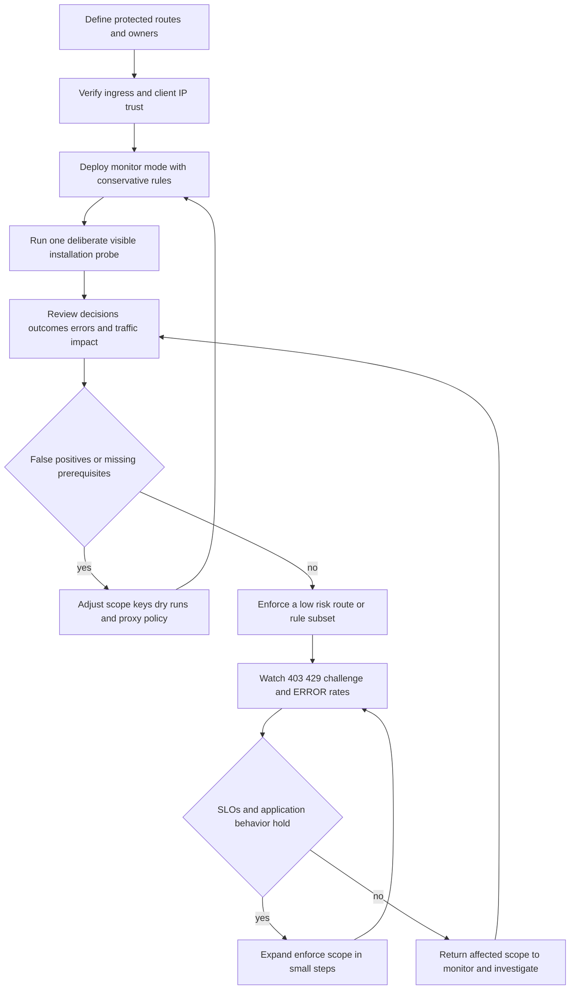

WebDecoy is safest when treated as a measured request control rather than a switch that is turned on everywhere at once. The SDK can make a local decision without an API key, while an API key adds hosted detection, eligible IP enrichment, violation telemetry, and automatic site-honeytoken arming in supported adapters. In either case, the application still owns its ingress boundary, response policy, state-store topology, secrets, and shutdown behavior.

This guide is an operator runbook. It concentrates on the decisions that can cause a production incident or weaken a control: observe before enforcing, establish the true client identity before keying a limit, choose availability versus protection deliberately for external dependencies, and make every distributed state transition shared and atomic where required. For detailed mechanics, see [Request Protection, Decisions, and Enforcement Semantics](/openwiki/concepts/request-decisions-and-enforcement.md), [Client Identity, Proxy Trust, Characteristics, and Edge Context](/openwiki/concepts/client-identity-proxy-trust-and-edge-context.md), [Rules, Shared State, Honeytokens, and Attack-Signature Boundaries](/openwiki/concepts/rules-rate-limits-and-deception.md), and [Self-Hosted Captcha and Browser-Signal Decision Flow](/openwiki/concepts/captcha-and-browser-signals.md).

## Production posture at a glance

| Area | Safe starting posture | Do not do |
| --- | --- | --- |
| Middleware mode | Start with `mode: 'monitor'`; inspect decisions and would-blocks before changing traffic. | Set `mode: 'enforce'` as the first installation step. |
| Installation proof | Run the reserved install probe deliberately and confirm a real visible receipt; separately exercise an ordinary trap only when its route is controlled. | Treat successful initialization or logs alone as proof that protection is active. |
| API keys | Keep server credentials in the deployment secret mechanism and omit them when local-only controls are sufficient. | Create, guess, commit, or put a server credential in client code. |
| Proxy identity | Configure framework proxy trust or the adapter's `trustProxy` to match the real deployment path. | Trust the leftmost `X-Forwarded-For` value or leave a proxied origin keyed as one proxy address. |
| Rate-limit state | Use a shared `RateLimitStore` before adding replicas, serverless concurrency, or autoscaling. | Assume the in-memory counter is fleet-wide. |
| Risky signatures | Start `attackSignatures()` body/header inspection in `dryRun: true`. | Describe it as a WAF or immediately block CMS/API content based on broad payload matching. |
| Honeytokens | Arm the tripwire before exposing the link; verify actual HTML injection or render the link yourself. | Advertise a per-instance random path across replicas, or assume a streamed response was rewritten. |
| Captcha | Use a production secret and shared replay/challenge state for horizontally scaled flows. | Use the development default in production or treat client fallback as server authorization. |
| Hosted calls and telemetry | Alert on `ERROR`, `NOT_RUN`, dependency failures, and report loss; retain application logs for evidence that must be durable. | Treat a final `ALLOW` as proof that every configured check ran or assume violation uploads are durable. |

## Staged rollout: observe, prove, then narrow enforcement

The supplied adapters and `createFetchGuard()` default to monitor mode. They still call `protect()`, make local decisions, evaluate rules, and expose the resulting typed decision, but they continue to the application rather than returning a 403 or 429. This makes monitoring a true traffic-preserving phase, including for a local throttle.



*The rollout changes enforcement only after identity, visibility, and the observed rule outcomes have been validated; monitor mode remains the rollback posture.*

### Phase 0 — define scope and ownership

1. Identify the routes whose availability is critical, the routes whose abuse cost is high, and health checks, static assets, webhooks, and internal callbacks that must be excluded or assigned an explicit policy. `skipPaths` is a prefix-or-regexp exemption, so keep patterns narrow; a broad prefix can create an unprotected subtree.
2. Decide what subject each limit protects: public-IP traffic, an authenticated tenant, an API credential, or a combination. The SDK-wide `characteristics` key defaults to IP; a rate rule's `keyBy` overrides it. An authenticated key may be fairer for an API, but it does not replace a validated client IP for IP enrichment, IP-specific filters, or attribution.
3. Write down the response contract before enforcement: a rule throttle becomes a 429 with `Retry-After`; a rule denial becomes a 403. A hosted `CHALLENGE` is a distinct conclusion that needs an intentional challenge/captcha route or a chosen blocked-response policy. Do not discover that behavior on a payment, login, webhook, or search-index route.
4. Assign an owner for monitoring decision errors, `NOT_RUN` prerequisites, denied traffic, shared-store availability, and proxy-topology changes. A security feature without an error owner often quietly becomes an allow-all feature.

### Phase 1 — deploy in monitor mode

Mount framework protection before application routes and after any body parser that is intentionally supplying body content to a rule. Do not cause the middleware to buffer a body merely for inspection: adapters populate query data, but body inspection remains opt-in so streaming semantics remain under application control.

In monitor mode, read the complete decision rather than only a legacy detection field:

- Express and Fastify attach `req.webdecoyDecision` / `request.webdecoyDecision`; Hono stores `c.get('webdecoyDecision')` (and retains the compatibility key `webdecoy`); fetch integrations receive `GuardOutcome.decision` from `guard.check()`.
- `Decision.conclusion` identifies `ALLOW`, `DENY`, `CHALLENGE`, or `ERROR`; `results` records every rule's state (`RUN`, `DRY_RUN`, `NOT_RUN`, or `CACHED`).
- `allowed` is **not** sufficient health telemetry: it is `true` for both `ALLOW` and fail-open `ERROR`. Use `isErrored()` or `conclusion === 'ERROR'` to distinguish a positive allow from a request for which no verdict was reached.

During the first observation window, segment decisions by route, method, resolved client-address class, rule, status family, response time, and deployment region. Look for all of the following before enforcing:

- expected deterministic hits and no unexpected application traffic at trap paths;
- `DRY_RUN` matches for every newly risky rule, particularly payload body/header signatures;
- `NOT_RUN` rates for filters, Web Bot Auth, async stores, and browser-signal rules; these are missing evidence, not passing evidence;
- unexpected common client identity (often a proxy address), shared rate-limit buckets, or shifted behavior after an ingress/CDN change;
- protection `ERROR`s, hosted-call latency, and a rising ratio of failures to detection calls;
- whether the intended honeytoken is actually present only in eligible HTML documents; and
- whether monitoring itself adds unacceptable request-path latency or response transformation risk.

### Phase 2 — verify a real receipt

Use the reserved probe once as an installation check, not as a permanent synthetic monitor or normal test fixture:

```sh
curl -A "WebDecoy-Test/1.0" http://localhost:3000/
```

The prefix is handled before rules, local analysis, and the decision cache. With a configured server client it sends a labelled detection through ingest and returns a denial, so enforce mode supplies an obvious blocked response; monitor mode deliberately continues to the application. Ingest classifies the probe as test traffic rather than ordinary protection data. Without a server client, the SDK still reports the local test-trigger denial but explicitly says that nothing reached a dashboard. Therefore, do not claim dashboard verification without checking the actual dashboard receipt, and do not run this probe casually in load tests, uptime checks, or browser fixtures.

Also prove the ordinary path that will be relied upon in production. For example, with a controlled tripwire, confirm that monitor mode records its decision while a normal page remains unaffected; later, confirm the same request receives the expected 403 only in a limited enforce canary. Do not test a path that could be fetched by a legitimate prefetcher, security scanner, or external monitor until it has first been observed in dry run.

For application tests, prefer the offline harness over the reserved probe. `createTestHarness()` suppresses an API key unless `allowNetwork: true`, uses a silent logger by default, and creates fresh local rule state, preventing a unit test from producing real hosted detections.

### Phase 3 — canary enforcement

Start with deterministic, low-ambiguity controls on a small route set: a path that is exclusively a scanner trap, or a measured rate limit on a non-critical endpoint. Keep remote score denials, challenging flows, IP-based filters, client signals, bot policy, and payload body/header inspection in monitor/dry-run until their prerequisites and false-positive characteristics are understood.

Canary metrics should compare pre- and post-enforcement application outcomes, not merely WebDecoy decisions: successful requests, 403/429/challenge volume, retries after 429, error rate, latency, conversion or task completion, support reports, and crawler/search effects. Roll back the affected scope to monitor mode if the application SLO or identity assumptions are violated; retain decisions, request IDs, and decision IDs to investigate rather than trying to reconstruct the incident from aggregate counts.

### Phase 4 — expand and continuously revalidate

Expand by route class, rule, or region—not all three at once. Re-enter observation whenever any of the following changes: proxy/CDN topology, number of replicas, caller-key design, rate-limit store, score threshold, response caching policy, captcha deployment, signature directories, or rule inspection surface. These are security-boundary changes even if no WebDecoy version changes.

## Fail-open and fail-closed: choose the boundary precisely

“Fail open” is not one behavior in WebDecoy. The following table separates decision availability from telemetry loss and from an explicitly closed rate-store policy.

| Failure or condition | SDK/adaptor behavior | Operational interpretation and action |
| --- | --- | --- |
| `protect()` cannot reach a verdict, such as missing required IP metadata, a failed hosted detection call, or a pipeline exception | Returns `conclusion: 'ERROR'`; `allowed` is true. Enforce adapters therefore continue by default. | This is intentional availability-first fail open. Alert on it; do not count it as an affirmative allow. If the route must be unavailable rather than unverified, implement a narrowly scoped application policy based on `conclusion`, with a tested outage plan. |
| Express/Fastify/Next middleware itself throws | The default `onError` logs and allows/continues. A custom `onError` can observe or return a response where the adapter supports it. | Keep an error hook observable and non-throwing. Changing it to fail closed moves application availability risk into middleware and should be justified per route. |
| Upstash rate-limit request, timeout, HTTP failure, or pipeline-command error | `onError: 'open'` is default and yields an allowed outcome; `onError: 'closed'` yields a denied outcome. | Choose closed only where the protected resource is more valuable than availability. Test both modes in the deployed runtime and alert on datastore failures in either mode. |
| IP enrichment unavailable for an `ip.*` filter | No enrichment is placed in context, so the dependent rule is `NOT_RUN`; protection continues otherwise. | Treat as a coverage gap. A final allow does not mean the IP policy was checked. |
| Web Bot Auth cannot be evaluated because required request authority is missing or the directory cannot yield a key | The rule has no usable verification verdict and does not fabricate one; inspect its outcome and surrounding diagnostics. | Correct authority/proxy handling and warm/monitor signature behavior before using it as a strict traffic gate. |
| Violation upload fails | The reporter drops the drained batch; it never changes the request decision or retries persistently. | Best-effort telemetry loss, not a block/allow decision. Use durable application logging if every event matters. |
| Honeytoken derivation or response injection fails | No token is injected or the original response is returned; arming failure can be reported through its callback. | Detection coverage is reduced rather than response availability being sacrificed. Alert on missing injection where a trap is expected. |
| Captcha client/server interaction fails | Client paths are designed to continue; sensitive server operations must independently require server token verification. | Do not treat browser fallback or a client-side score as authorization. Decide explicitly whether the protected operation itself fails open or asks the user to retry. |
| Tracer exporter misbehaves | Tracer calls are swallowed. | Observability must not become a request outage; separately monitor exporter/collector health. |

### What `ERROR` means to an enforcer

`ERROR` means **no verdict was reached**, not “WebDecoy says this client is safe.” It carries a generated decision ID and error text, but the legacy-compatible `allowed` property remains true. Consequently, default enforcement is availability-first:

```ts
const decision = await webdecoy.protect(metadata);

if (decision.isErrored()) {
  // Record an operational failure. Do not label this as an affirmative allow.
}

if (!decision.allowed) {
  // Apply the route's DENY or CHALLENGE policy.
}
```

A fail-closed application response can be appropriate for a narrowly defined high-cost action, but it is not the SDK default and must be weighed against host/ingest outages, malformed requests, and operational recovery. Avoid a global “deny on any error” policy that turns a third-party network event into a site-wide outage. Use a route-specific policy, a clear user-facing retry behavior, monitoring, and a tested rollback.

## Identity and proxy configuration are enforcement configuration

Rate limits, IP enrichment, IP filters, captcha difficulty/token binding, remote detection metadata, and violation reports all depend on the resolved client IP. A forwarding header becomes usable only after the origin trusts the proxy that wrote the relevant end of the chain. The resolver counts trusted hops from the right; never key decisions using a leftmost client-supplied header value.

| Deployment shape | Recommended setup | Required verification |
| --- | --- | --- |
| Direct Node origin | Leave resolver trust disabled and use the peer/socket address. | Send forged forwarding headers and confirm the observed limit key does not change. |
| Express/Fastify behind a fixed proxy chain | Configure the framework's own trust setting, or supply WebDecoy `trustProxy` with the real hop count. | Exercise two clients through the deployed proxy and padded `X-Forwarded-For` values. |
| CDN plus platform edge | Set the actual number of trusted hops or use precise controlled CIDRs when path depth varies. | Test every ingress route; a count that is too high can promote a forged entry. |
| Cloudflare-only origin | `trustProxy: 'cloudflare'` is appropriate only when the origin cannot be reached except through Cloudflare. | Verify origin firewall/security-group and alternate hostnames; a public origin makes `CF-Connecting-IP` forgeable. |
| Next.js Edge, Hono, or generic fetch runtime | These environments commonly lack a socket peer and default to one trusted hop. Set the actual topology explicitly. | Confirm platform/CDN order in production rather than copying a local setting. |

Under-trusting normally collapses users behind a proxy into one IP bucket: a per-IP rate limit becomes a site-wide denial and reports describe the proxy. Over-trusting is a bypass: callers can select fresh rate-limit identities, affect IP filters, and poison attribution. Both deserve an integration test using the deployed chain, including direct-origin access attempts, IPv6 forms, malformed headers, and proxy-chain padding.

`getIP` overrides framework and WebDecoy proxy resolution. It is an advanced extension point, not a shortcut: its output must have the same trust, validation, normalization, and stability properties as the built-in resolver.

## Shared state and hosted dependencies

### Replicas and serverless deployments

The default rate-limit store is in-process. It is correct for one long-lived process but becomes approximately `max × instances` with independent replicas and resets at cold start. Introduce a shared store **before** enabling a fleet-wide policy, not after observing a bypass. The async-store contract is consumed during `protect()` preparation exactly once per request; direct synchronous `evaluateRules()` cannot call a network store and reports `NOT_RUN` instead of silently presenting a nonfunctional limiter as an allow.

`upstashRateLimitStore()` uses Upstash Redis over `fetch`, which is suitable for edge/serverless runtimes that cannot open a Redis socket. Its required endpoint and token must come from deployment secret configuration; never paste values into source, test fixtures, incident notes, or this page. The fixed-window implementation uses a window-qualified key and expiry; the sliding implementation uses a timestamp sorted set. Redis expiry performs routine counter cleanup, but storage namespaces/prefixes, access controls, retention, and incident access are still operator responsibilities.

Choose the store error policy by resource cost:

- **`onError: 'open'` (default):** preserve application availability when the counter service is unavailable. This is usually appropriate for general page traffic and low-cost endpoints.
- **`onError: 'closed'`:** deny when a consume operation cannot be completed. Reserve it for actions where an unmetered request is more harmful than a temporary refusal, and ensure users have an understandable retry path.

Captcha state has a stricter distributed requirement. In-memory challenge, token replay, fingerprint/rate, and browser-score stores are not cross-replica guarantees. Before scaling, provide shared stores with expiry and atomic consume semantics, use the same signing secret across issuers/verifiers, and test cross-instance issue/solve, token replay, and score/request handoff. The default in-memory store is a development and focused-test convenience, not a distributed replay defense.

### Hosted detection, enrichment, and cache boundaries

A server credential causes the SDK to create its authenticated client; it does not mean every request reaches the hosted service. Local rules run first and locally enforced denials/throttles skip hosted detection. After local allow, the SDK may reuse a short-lived, process-local remote `DENY`/`CHALLENGE`, allow a low-risk request locally, or send a detection request when analysis/TLS conditions call for it. `ALLOW`, local rule decisions, and errors are deliberately not decision-cached so local controls still see each request and a changed client is reassessed.

IP enrichment is a separate optional hosted dependency for filters referencing `ip.*`. It is cached per SDK instance and deduplicates concurrent requests, but failure returns no enrichment rather than imposing an outage. Watch `NOT_RUN` rather than assuming a quiet filter means the request was assessed.

API-key validation is also a live detection request, not an offline format check or a comprehensive connectivity probe. Use it as a deliberate, controlled integration operation, not inside routine test suites or request handling.

## Deception, payload inspection, and signatures

### Honeytokens: visible receipt, arming order, and HTML limits

A honeytoken has value only when the advertised path is guarded. Automatic adapter arming derives a stable site token from the server API key, adds a `tripwire` for every active path, and only then allows the token to be injected. Derivation failure deliberately results in no link rather than bait with no trap. A stable derivation matters in replicas: a random per-process path could be served by one instance and checked by another that never armed it.

With an API key, Express, Fastify, and fetch/Hono paths can arm/inject by default. The mechanism is deliberately conservative:

- only eligible `text/html` responses are modified, never JSON or arbitrary content;
- a fetch response with an already-used body is passed through;
- Fastify does not buffer streams to insert an anchor and logs one warning per process with manual embedding guidance;
- Express protects response integrity by avoiding unsafe rewrites and correcting content length where it can; and
- an injection error returns the original response rather than breaking delivery.

Fastify awaits derivation during plugin registration, so its first served request has no unarmed startup window. Other asynchronous arming paths can briefly serve pages without a link while derivation settles; that is a coverage gap to monitor, not a reason to block boot. Next.js exposes a helper for manual rendering because middleware cannot safely rewrite streamed React Server Component output.

Verify honeytokens in production with a real HTML receipt: fetch a representative non-streaming page, inspect the delivered HTML, confirm exactly the expected hidden link is present, and then confirm its guarded path in monitor mode before expanding enforcement. Do not put traps in sitemaps/navigation, and use dry run for pages exposed to aggressive prefetchers or link-preview agents. If manually using rotating site tokens, account for CDN cache lifetime and clock synchronization; cached old links can outlive the active grace window.

### Attack signatures: narrow by design

`attackSignatures()` is a curated detector for unambiguous injection forms in path and query by default; it is not a general WAF. Body and header inspection are opt-in, and the `Cookie` header is never inspected. Payloads in CMS content, templates, webhooks, and URL-bearing fields can be legitimate, so begin body/header coverage with `dryRun: true`, record the signature ID and location, and only then choose exclusions or a scoped enforcing route. Keep the rule's byte bound and narrow signature set intact; a security control must not become an attacker-controlled parsing-cost problem.

### Web Bot Auth: cryptographic identity with a warm-path boundary

`webBotAuth()` and `detectBot()` verify RFC 9421-style HTTP message signatures against a curated directory cache. Warm verification uses cached trusted keys and WebCrypto rather than fetching a URL selected by a request header; this avoids an SSRF-shaped directory lookup on the request path. The SDK warms the verifier when a Web Bot Auth rule is configured. A cold cache can fetch the curated directories once, while a populated stale cache serves last-known keys and refreshes in the background.

Treat signature rollout as policy rollout. First monitor verdicts such as `verified`, `impersonation`, `claimed`, and absent/unevaluable signatures; confirm that the origin receives correct Host/authority and scheme information through its proxy chain. Do not grant sensitive access merely because a client self-identifies in a User-Agent, and do not assume a missing host can be verified—the SDK skips reconstruction rather than guessing an authority. If a verified-agent exception affects access or pricing, combine it with an origin-isolation review and an application authorization policy.

## Captcha and browser signals: secret, authorization, and lifecycle rules

The self-hosted captcha uses HMAC-protected challenges and tokens. In production, its `secret` must be supplied through secure deployment configuration: a missing value or the built-in development default is rejected. Do not expose a signing secret to browser code or logs. A successful token is short lived and single use; signature validity alone is insufficient for fleet-wide replay prevention unless token consumption is backed by shared state.

Browser evidence and local client fallback are not server authorization. A sensitive route must verify the token server-side and should bind it to the intended action/policy. Browser signals are probabilistic evidence; a request with no browser-session verdict is intentionally `NOT_RUN` and allowed by `clientSignals()` so non-JavaScript clients and legitimate crawlers are not automatically denied. Begin client-signal enforcement with `dryRun: true` and require the score/session handoff, storage, proxy identity, and user experience to work across replicas before acting on it.

Configure captcha endpoint origin and path consistently with the browser integration, ensure the endpoints are reachable from the browser, and mount required JSON parsing before the endpoint adapter. Keep the endpoint service and protected-operation verifier on compatible shared signing/replay configuration. During an orderly shutdown, drain application work before ending the stores or process; aborted/serverless execution can still lose in-memory state, so do not represent it as durable security audit evidence.

## Observability, diagnostics, and cleanup

### Log and trace decisions as structured operational events

Supply a logger compatible with the SDK's `debug`/`info`/`warn`/`error` interface so WebDecoy events join the application's structured logs. The default console logger gates debug/info on `debug`, but warnings and errors remain visible. For pino-style loggers, use `fromPino()` because pino expects structured fields before the message; passing a pino instance directly can lose structured context.

Optionally inject an OpenTelemetry-compatible tracer. The SDK emits `webdecoy.protect` and `webdecoy.rules` spans with useful attributes including decision ID, conclusion, allowed status, deciding rule, evaluated-rule count, remote/local indication, and error. The tracer is injected rather than imported, and every tracing operation is guarded so a bad exporter cannot fail a request. Join these records using the decision ID and, where applicable, the hosted detection ID.

A useful dashboard/alert set includes:

- decisions by `conclusion`, route, rule, mode, region, and adapter;
- `ERROR` decisions separately from affirmative `ALLOW`s;
- rule outcomes by `RUN`, `DRY_RUN`, `NOT_RUN`, and `CACHED`;
- 403, 429, and challenge responses versus application success/retry rates;
- hosted detection and Upstash dependency latency/error rate;
- violation reporter buffer/flush failure signals and any independently durable security log;
- honeytoken injection coverage and streamed-response warnings; and
- changes in resolved client-IP/cardinality that indicate proxy or caller-key regression.

Do not log raw credentials, captcha secrets, bearer headers, cookies, full browser signal payloads, or unbounded request bodies. Minimize retained IP- and decision-key data according to the application's privacy policy, access controls, and incident-retention requirements.

### Shutdown and resource ownership

A `WebDecoy` instance owns rule-engine resources and, when configured, an in-memory violation reporter timer/buffer. At graceful shutdown, stop accepting new requests, allow active requests to finish under the application's deadline, and call:

```ts
await webdecoy.destroy();
```

`destroy()` destroys rule resources and asks the reporter to stop its timer and flush the remaining buffered violations. This is best effort: failed reporting is dropped and abrupt termination or serverless suspension can still lose buffered events. It must not be the sole system of record for a security event that requires durable retention.

Treat creation and destruction as lifecycle-scoped. Create a long-lived SDK/guard instance for a worker or process rather than per request so rule state, caches, reporter batching, and optional verifier warmup have coherent behavior; also ensure the lifecycle owner invokes `destroy()` during a controlled shutdown. In serverless environments, expect process-local caches and buffers to disappear and do not depend on cleanup hooks being called.

## Focused production verification plan

Use the narrowest test that proves the boundary being changed, then run the repository aggregate gates when modifying the implementation:

1. **Rule contract:** Use `createTestHarness()` to assert a normal request is `ALLOW`, a controlled tripwire is denied, and a rate limit crosses its intended boundary. Assert `conclusion`, relevant `deniedBy()`, and rule state—not only `allowed`.
2. **Monitor/enforce:** In an adapter integration test, prove monitor leaves both 403 and 429 candidates flowing to the app and exposes the typed decision. Then prove enforce returns the expected 403 or 429 and `Retry-After` response contract.
3. **Failure policy:** Stub hosted detection failure and assert `ERROR` remains allowed but is observable. Stub the rate store in both `onError` modes and assert the intended open/closed behavior. Ensure a throwing tracer/logger path cannot alter the protection conclusion.
4. **Proxy topology:** Use a real adapter test with forged/padded forwarding chains, expected trusted hops/CIDRs, a direct-origin attempt, and multiple clients. Verify the actual rate-limit bucket and reported identity behavior.
5. **Distributed state:** Exercise two SDK/service instances against the same shared rate store; issue captcha work on one instance and verify/consume on another. Confirm token replay fails globally and client-score lookup succeeds after load balancing.
6. **Honeytoken response safety:** Test HTML injection, non-HTML pass-through, correct content length where applicable, streamed response behavior, and the link/path arming relationship. Inspect a deployed page as the final receipt.
7. **Hosted and signature paths:** Mock detection/enrichment/directory failures and success; test warm signature verification, authority reconstruction, and a missing authority. Do not use a real credential in ordinary tests.
8. **Operational lifecycle:** Confirm shutdown calls `destroy()`, metrics/logs record any final flush failure, and abrupt-termination assumptions are documented as telemetry loss.

The repository's focused tests provide regression anchors for these boundaries: adapter tests cover monitor/enforce translation and honeytoken response safety; `client-ip.test.ts` and Express trusted-proxy tests cover address trust; `rate-limit-store.test.ts` covers shared asynchronous consumption and Upstash failure mode; captcha tests cover production-secret rejection and token/challenge replay; tracing tests ensure instrumentation cannot break requests; and test-trigger/testing-helper tests keep installation verification deliberate and unit tests offline. Run `npm test` after changes that span packages, and use `npm run check:edge` for core/Next/Hono dependency-path changes.
