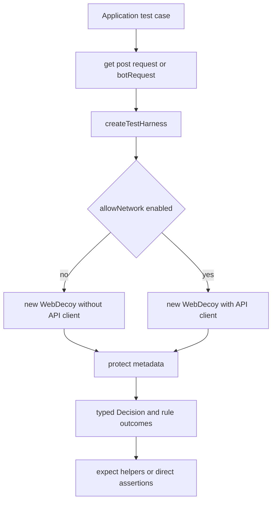

WebDecoy has two deliberately different testing surfaces:

- **Application tests** use the public `@webdecoy/node/testing` subpath to exercise the same `WebDecoy.protect()` policy path that an application configures, without accidentally contacting WebDecoy or filing test requests as detections.
- **Repository tests** are internal Jest tests and a small set of source-inspection invariants. They test implementation boundaries that a consumer should not import: framework response rewriting, normalized captcha HTTP handling, proxy parsing, stateful stores, and architectural rules that span packages.

This separation matters. A policy test should be readable, deterministic, isolated, and offline. A maintainer test must also catch a safe-looking local change that makes adapters disagree, corrupts a response, weakens proxy attribution, or introduces a Node dependency into an Edge bundle.

See [Quickstart](/openwiki/quickstart.md) for an installation check, [Request decisions and enforcement](/openwiki/concepts/request-decisions-and-enforcement.md) for verdict semantics, [Framework adapters](/openwiki/integrations/framework-adapters.md) for runtime behavior, and [Build, test, and release](/openwiki/operations/build-test-and-release.md) for the broader contributor workflow.

## Consumer policy tests: `@webdecoy/node/testing`

`@webdecoy/node/testing` is a package export separate from the normal SDK entry point. It is intended for an application's own test suite, not for production middleware. The package builds `src/testing.ts` as that subpath and exports its declarations, so import the helpers by their public package path rather than reaching into SDK source files.

```ts
import { tripwire, rateLimit } from '@webdecoy/node';
import {
  createTestHarness,
  get,
  expectAllowed,
  expectDenied,
  protectMany,
} from '@webdecoy/node/testing';

it('blocks probes but permits an ordinary page', async () => {
  const wd = createTestHarness({ rules: [tripwire()] });

  expectDenied(await wd.protect(get('/.env')), { rule: 'tripwire' });
  expectAllowed(await wd.protect(get('/products')));
});

it('enforces the configured rate-limit boundary without waiting', async () => {
  const wd = createTestHarness({
    rules: [rateLimit({ max: 3, window: 60, action: 'DENY' })],
  });

  const results = await protectMany(wd, get('/login'), 5);
  expect(results.map((result) => result.conclusion)).toEqual([
    'ALLOW', 'ALLOW', 'ALLOW', 'DENY', 'DENY',
  ]);
});
```

### What the harness isolates

`createTestHarness()` constructs a new `WebDecoy` instance. It is **offline by default**: it removes the API key passed in its options unless `allowNetwork: true` is explicitly set, and it uses the silent logger unless the test supplies one. Thus an ambient `WEBDECOY_API_KEY` or a copied production configuration cannot silently turn a unit test into a remote detection, dashboard event, cost, or flaky network dependency.

Create a harness per test case. Each normal construction receives its own in-memory rule state, so rate-limit counters do not carry from one case into another. This is especially important for limits: sharing a module-level SDK makes test order affect whether the next request is allowed. Network access is an exceptional integration-test choice, not the default:

```ts
const offline = createTestHarness({
  apiKey: process.env.WEBDECOY_API_KEY,
  rules: [tripwire()],
});

const integrationHarness = createTestHarness({
  apiKey: process.env.WEBDECOY_API_KEY,
  allowNetwork: true,
});
```

The first harness evaluates local rules but has no SDK API client. The second is an explicit opt-in; use it only where live integration behavior is actually the subject of the test and ensure its traffic policy is appropriate. It is not a substitute for the offline policy tests above.



This shows the public harness's default offline path and its explicit network opt-in.

### Build realistic request metadata with little boilerplate

The helpers create `RequestMetadata` with stable defaults for method, path, documentation IP, browser user agent, headers, and timestamp:

- `request(overrides)` is the general builder.
- `get(path, overrides)` separates `?query` from the path; this lets attack-signature rules inspect the query as they do in an adapter.
- `post(path, body, overrides)` sets `POST` and a text body.
- `botRequest(userAgent, overrides)` isolates declared-agent policy cases.
- `protectMany(sdk, metadataOrFactory, count)` sequentially calls `protect()` and returns all decisions. Pass a factory when each request needs different characteristics, such as an API key header.

Do not use real HTTP traffic merely to prove a local policy. The harness invokes `protect()` directly, making input construction and decision assertions explicit. Use framework-level tests only when the framework translation, enforcement response, headers, or response decoration is what needs validation.

### Assert conclusions, not just `allowed`

A `Decision` has a four-valued `conclusion`: `ALLOW`, `DENY`, `CHALLENGE`, or `ERROR`. Its compatibility boolean `allowed` is true for both `ALLOW` and fail-open `ERROR`; therefore an assertion that only checks `allowed` can accidentally certify a request for which no verdict was reached.

Use the helpers as the default policy vocabulary:

- `expectDenied(decision, { rule?, reason? })` checks `DENY`, optionally proves which rule was the effective denying rule with `deniedBy()`, and can match the reason with a substring or `RegExp`.
- `expectAllowed(decision)` accepts only `ALLOW`; it intentionally fails for `ERROR`.
- `expectRuleState(decision, rule, state)` inspects one named outcome and reports the complete decision when the rule is absent or in a different state.

The helpers' failure messages include the conclusion, reason, each rule, and its state. That is useful when an expected policy did not run rather than merely returned the wrong boolean.

```ts
import { filter, tripwire } from '@webdecoy/node';
import {
  createTestHarness,
  expectAllowed,
  expectDenied,
  expectRuleState,
  get,
  request,
} from '@webdecoy/node/testing';

it('distinguishes a dry-run signal and a malformed request', async () => {
  const dryRun = createTestHarness({ rules: [tripwire({ dryRun: true })] });
  const observed = await dryRun.protect(get('/.env'));

  expectAllowed(observed);
  expectRuleState(observed, 'tripwire', 'DRY_RUN');

  const missingSignal = createTestHarness({
    rules: [filter({ expression: 'ip.tor' })],
  });
  expectRuleState(await missingSignal.protect(get('/')), 'filter:ip.tor', 'NOT_RUN');

  const malformed = await createTestHarness({ rules: [tripwire()] })
    .protect(request({ ip: '' }));
  expect(malformed.conclusion).toBe('ERROR');
  expect(malformed.allowed).toBe(true); // SDK fail-open behavior
});
```

`RUN` means the rule evaluated. `DRY_RUN` records a non-allowing rule conclusion without allowing it to decide enforcement. `NOT_RUN` means required input was unavailable; it must not be confused with a rule that ran and allowed. `CACHED` means a prior decision was reused rather than the rule being evaluated anew. Test the state that is relevant to the policy rollout, not only the final verdict.

## Repository test layers

Internal tests use Jest and live beside source under `packages/*/src/**/*.test.ts`; they are not the public test-harness API. Package Jest configurations execute TypeScript tests from `src` and collect source coverage. At the repository root, Turbo makes both `build` and `test` depend on upstream package builds, so the broad checks exercise workspace dependency order as well as individual package scripts.

### Core decision, rules, and state

The core tests validate contracts that consumer tests rely on:

- The decision model preserves a typed `Decision` and keeps fail-open `ERROR` distinct from `ALLOW`; rule outcomes expose whether a rule ran, dry-ran, was unavailable, or came from cache.
- Rule-engine tests verify that a tripwire violation forwards the `wd_clearance` cookie value, while other rule types do not accidentally turn that cookie into a fingerprint-enforcement signal.
- Rate-limit store tests cover the in-memory default and an asynchronous shared-store seam. A shared store must enforce one budget across SDK instances and consume exactly once per protected request; an unprepared async store reports `NOT_RUN` rather than appearing to allow.
- Upstash-store tests mock `fetch` and cover fixed and sliding window mechanics, command failures, credential validation, and explicit fail-open versus fail-closed behavior without contacting Redis.

When changing a rule, its outcome state, a decision conversion, characteristic keying, or state-store lifecycle, run the affected core test file in addition to a consumer-style harness case. If a rate limiter starts timers in a direct test, call `await wd.destroy()` when appropriate so its resources do not keep Jest alive.

### Framework-boundary tests

Adapter tests run through a framework-shaped application rather than only invoking helpers. The test transport matches the risk being checked:

- Express honeytoken tests create a real local HTTP server because the middleware intercepts `res.write` and `res.end`. They confirm HTML injection placement, intact JSON and text responses, correct `Content-Length`, streaming behavior, opt-out and no-key paths, and—critically—that following the generated path reaches an armed tripwire.
- Fastify tests use `app.inject()` to validate its supported hooks. They ensure full HTML is rewritten while JSON, plain text, and streams are untouched; they also require one useful warning when a streamed response cannot be injected and verify replicas derive the same armed path.
- Hono tests use `app.request()`, the fetch-shaped path used in Workers, Bun, and Deno. They cover enforce responses (403 for tripwire and 429 plus `Retry-After` for limits), monitor-mode continuation and context decision access, skip paths, custom blocking handlers, query inspection, and safe HTML-only decoration.
- Next.js tests assert the framework's request-forwarding representation rather than merely inspecting response headers. They ensure middleware annotations are passed to application code but not leaked to the browser, forged inbound annotations cannot be trusted, and monitor mode annotates what would have happened while serving the request.

These are regression tests for framework contracts, not a reason for consumers to use real servers in every policy unit test. Add or update them whenever a change touches request extraction, monitor/enforce branching, shared block response construction, request annotations, a framework hook, or HTML rewriting.

### Captcha HTTP and Edge execution boundaries

Captcha endpoint tests exercise `createCaptchaEndpoints()` through its normalized request/response interface—the seam all adapters translate into. They cover fall-through for non-captcha paths, configurable base paths, challenge issuance, checkbox challenge → proof-of-work solve → verification → token verification, invisible scoring, and malformed token requests. The captcha example is a manual application harness: browser widget signals and proof-of-work travel through `/__webdecoy/challenge` and `/__webdecoy/verify`, while `/login` verifies the issued token. Its in-memory stores are suitable for the demo; shared stores are required for multi-instance or serverless deployment.

The Edge runtime test goes further than type checking. It bundles the core entry point for a browser platform, evaluates it in Vercel's Edge Runtime VM, and executes keyless protection with rate limiting and a honeytoken. It also verifies Web Bot Auth with Web Crypto and captcha token issue, verification, and replay behavior in that VM. This catches both bundle-time Node built-ins and runtime dependencies on Node globals.

### Cross-package source-inspection invariants

`packages/webdecoy/src/invariants.test.ts` intentionally reads shipped TypeScript source across packages. It protects architectural properties that isolated behavior tests can miss:

1. **One client-IP resolver:** forwarding headers may only be read in `client-ip.ts`, so all adapters share the same proxy-trust model rather than reintroducing a spoofable leftmost `X-Forwarded-For` implementation.
2. **One decision representation:** `sdk.ts` must create `Decision` instances rather than return an `allowed` object literal or spread a decision into a plain object, which would lose narrowing methods and permit its boolean and conclusion to drift.
3. **Visible unavailable rules:** filter, Web Bot Auth, and rate-limit rules that can lack required inputs need a `NOT_RUN` path, not a misleading allow.
4. **One adapter policy core:** rule-refusal responses, skip-path matching, and site-honeytoken derivation/arming have designated shared implementations. A new adapter should call them instead of copying a variant.
5. **Edge package graphs remain portable:** shipped core, Next.js, and Hono source must not import `node:` modules.

Treat an invariant failure as an architectural warning, not as a regex to work around. Move duplicate policy logic into the shared owner or revise the invariant only after deliberately changing that ownership model.

## Focused validation and the repository gate

Start with the smallest test that proves the behavior you changed, then run checks broad enough to detect the boundaries it may have crossed. Useful focused commands are:

```bash
# Public harness / decision behavior in the core package
npm test -w @webdecoy/node -- src/testing.test.ts

# Proxy parsing or workspace invariants
npm test -w @webdecoy/node -- src/client-ip.test.ts
npm test -w @webdecoy/node -- src/invariants.test.ts

# Stateful rate-limit behavior and shared-store contract
npm test -w @webdecoy/node -- src/rules/rate-limit-store.test.ts

# Framework boundary after changing that adapter
npm test -w @webdecoy/express -- src/honeytoken-injection.test.ts
npm test -w @webdecoy/fastify -- src/honeytoken-injection.test.ts
npm test -w @webdecoy/hono -- src/middleware.test.ts
npm test -w @webdecoy/nextjs -- src/middleware.test.ts

# Captcha normalized HTTP flow or actual Edge VM execution
npm test -w @webdecoy/node -- src/captcha/http.test.ts
npm test -w @webdecoy/node -- src/edge-runtime.test.ts
```

A focused test does not replace the repository gate. Before merging a cross-package change—or when uncertain what it affects—run:

```bash
npm test
npm run lint
npm run build
npm run check:edge
```

`npm test`, `npm run lint`, and `npm run build` dispatch through Turbo; build and test account for upstream workspace builds. `npm run check:edge` bundles the public core, Next.js, and Hono entry points with esbuild's browser platform, failing if any reachable Node built-in enters their graphs. For a core decision or rule change, pair its focused test with the invariant and edge checks. For an adapter change, pair the adapter's framework-level test with the matching core test if it changes metadata extraction, decision consumption, or response construction. For a captcha or storage change, exercise both its direct seam and the end-to-end lifecycle it feeds.
